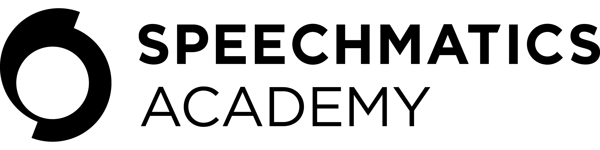

<div align="center">

<picture>
  <source media="(prefers-color-scheme: dark)" srcset="logos/speechmatics-academy-white-2400x600.png">
  <source media="(prefers-color-scheme: light)" srcset="logos/speechmatics-academy-black-2400x600.png">
  
</picture>

<br/>
<br/>
**Working examples, integrations, and templates for the Speechmatics SDK's.**

Comprehensive collection of code examples demonstrating real-world applications, third-party integrations, and best practices.


**Examples • Integrations • Use Cases • Copy-Paste Ready**

[Browse Examples](#example-categories) • [Quick Start](#quick-start) • [Contributing](#contributing)

</div>

---

## 📋 Table of Contents

- [Quick Start](#quick-start)
- [Example Categories](#example-categories)
- [Migration Guides](#migration-guides)
- [Finding Examples](#finding-examples)
- [Example Structure](#example-structure)
- [Contributing](#contributing)
- [Support & Resources](#support--resources)


---

<h2 id="quick-start">⚡ Quick Start</h2>

### Prerequisites

This repository contains examples for the Speechmatics Python SDK. Install the SDK first:

```bash
# Install the package you need
pip install speechmatics-batch     # For batch transcription
pip install speechmatics-rt        # For real-time streaming
pip install speechmatics-voice     # For voice agents
pip install speechmatics-tts       # For text 
```

📚 [SDK Documentation](https://github.com/speechmatics/speechmatics-python-sdk) | [API Reference](https://docs.speechmatics.com)

### Option 1: Clone and Run

```bash
# Clone the repository
git clone https://github.com/speechmatics/speechmatics-academy.git
cd speechmatics-academy

# Navigate to an example
cd basics/01-hello-world/python

# Install dependencies
pip install -r requirements.txt

# Set up environment variables
cp ../.env.example .env
# Edit .env and add your SPEECHMATICS_API_KEY

# Run the example
python main.py
```

### Option 2: Direct Copy

Use [degit](https://github.com/Rich-Harris/degit) to copy individual examples:

```bash
# Install degit
npm install -g degit

# Copy an example
degit speechmatics/speechmatics-academy/basics/01-hello-world my-project
cd my-project
```
---

<h2 id="example-categories">📚 Example Categories</h2>

### 🟢 Fundamentals

Fundamental examples for getting started with the Speechmatics SDK.

| Example | Description | Packages | Difficulty |
|---------|-------------|----------|------------|
| [Hello World](basics/01-hello-world/) | The absolute simplest transcription example | `Batch` |  Beginner |
| [Batch vs Real-time](basics/02-batch-vs-realtime/) | Learn the difference between API modes | `Batch` `RT` |  Beginner |
| [Configuration Guide](basics/03-configuration-guide/) | All configuration options in one place | `Batch` `RT` |  Beginner |
| [Audio Intelligence](basics/04-audio-intelligence/) | Extract insights with sentiment, topics, and summaries | `Batch` |  Intermediate |
| [Multilingual & Translation](basics/05-multilingual-translation/) | Transcribe 50+ languages and translate | `Batch` `RT` |  Intermediate |
| [Real Time Turn Detection](basics/07-turn-detection/) | Detect when speech ends using silence-based turn detection | `RT` |  Intermediate |
| [Voice Agent Turn Detection](basics/08-voice-agent-turn-detection/) | Intelligent turn detection with Voice SDK presets | `Voice` |  Intermediate |

[Browse all basics examples →](basics/)

---

### 🔌 Integrations

Third-party framework and service integrations.

| Integration | Example | Features | Languages |
|-------------|---------|----------|-----------|
| **LiveKit** | [Voice Assistant](integrations/livekit/voice-assistant/) | Real-time, diarization, WebRTC | Python |
| **Pipecat AI** | [Simple Voice Bot](integrations/pipecat/simple-voice-bot/) | Conversational AI, interruptions | Python |
| **FastAPI** | [Transcription API](integrations/web-frameworks/fastapi/) | REST API, async endpoints | Python |
| **Flask** | [Transcription Service](integrations/web-frameworks/flask/) | Web service, file uploads | Python |

[Browse all integrations →](integrations/)

---

### 🎯 Use Cases

Example applications for specific industries.

_Use case examples coming soon! Check back for industry-specific implementations including call center analytics, meeting transcription, podcast processing, and more._

---

<h2 id="migration-guides">🔄 Migration Guides</h2>

Switching from another speech-to-text provider? Our migration guides help you transition smoothly with feature mappings, code comparisons, and practical examples.

| From | Guide | Features Covered | Status |
|------|-------|------------------|--------|
| **Deepgram** | [Migration Guide](guides/migrating-from/deepgram/) | Batch, Streaming, Diarization, Custom Vocabulary | Available |
| **AssemblyAI** | [Migration Guide](guides/migrating-from/assemblyai/) | Transcription, Audio Intelligence, Real-time | Coming Soon |
| **Google Cloud Speech** | [Migration Guide](guides/migrating-from/google-speech/) | Batch, Streaming, Multi-language | Coming Soon |
| **AWS Transcribe** | [Migration Guide](guides/migrating-from/aws-transcribe/) | Batch Jobs, Streaming, Custom Vocabulary | Coming Soon |
| **Azure Speech** | [Migration Guide](guides/migrating-from/azure-speech/) | REST API, WebSocket, Pronunciation | Coming Soon |

Each migration guide includes:
- **Feature Mapping** - Direct equivalent features comparison
- **Code Comparison** - Side-by-side before/after examples
- **Migration Checklist** - Step-by-step migration process
- **Advantages** - Benefits of switching to Speechmatics
- **Working Examples** - Complete runnable code

[Browse all migration guides →](guides/migrating-from/) | [Migration Template](docs/MIGRATION_TEMPLATE.md)

---

<h2 id="finding-examples">🔍 Finding Examples</h2>

### By Package

Find examples for the SDK package you installed:

| Package | Description | Examples |
|---------|-------------|----------|
| **`speechmatics-batch`** | Async transcription of audio files | [Hello World](basics/01-hello-world/), [Batch vs Real-time](basics/02-batch-vs-realtime/), [Configuration Guide](basics/03-configuration-guide/), [Audio Intelligence](basics/04-audio-intelligence/), [Multilingual & Translation](basics/05-multilingual-translation/), [FastAPI](integrations/web-frameworks/fastapi/), [Flask](integrations/web-frameworks/flask/) |
| **`speechmatics-rt`** | Real-time streaming transcription | [Batch vs Real-time](basics/02-batch-vs-realtime/), [Configuration Guide](basics/03-configuration-guide/), [Multilingual & Translation](basics/05-multilingual-translation/), [Turn Detection](basics/07-turn-detection/), [FastAPI](integrations/web-frameworks/fastapi/) |
| **`speechmatics-voice`** | Voice agent with conversation management | [Voice Agent Turn Detection](basics/08-voice-agent-turn-detection/), [LiveKit Voice Assistant](integrations/livekit/voice-assistant/), [Pipecat Voice Bot](integrations/pipecat/simple-voice-bot/) |
| **`speechmatics-tts`** | Text-to-speech synthesis | [LiveKit Voice Assistant](integrations/livekit/voice-assistant/), [Pipecat Voice Bot](integrations/pipecat/simple-voice-bot/) |

### By Feature

| Feature | Examples |
|---------|----------|
| **Batch Transcription** | [Hello World](basics/01-hello-world/), [Batch vs Real-time](basics/02-batch-vs-realtime/), [Configuration Guide](basics/03-configuration-guide/), [Audio Intelligence](basics/04-audio-intelligence/) |
| **Real-time Streaming** | [Batch vs Real-time](basics/02-batch-vs-realtime/), [Configuration Guide](basics/03-configuration-guide/), [Turn Detection](basics/07-turn-detection/), [LiveKit Voice Assistant](integrations/livekit/voice-assistant/) |
| **Turn Detection** | [Turn Detection](basics/07-turn-detection/), [Voice Agent Turn Detection](basics/08-voice-agent-turn-detection/) |
| **Voice Agents** | [Voice Agent Turn Detection](basics/08-voice-agent-turn-detection/), [LiveKit Voice Assistant](integrations/livekit/voice-assistant/), [Pipecat Voice Bot](integrations/pipecat/simple-voice-bot/) |
| **Speaker Diarization** | [Configuration Guide](basics/03-configuration-guide/), [LiveKit Voice Assistant](integrations/livekit/voice-assistant/) |
| **Sentiment Analysis** | [Audio Intelligence](basics/04-audio-intelligence/) |
| **Topic Detection** | [Audio Intelligence](basics/04-audio-intelligence/) |
| **Summarization** | [Audio Intelligence](basics/04-audio-intelligence/) |
| **Translation** | [Multilingual & Translation](basics/05-multilingual-translation/) |
| **Text-to-Speech** | [LiveKit Voice Assistant](integrations/livekit/voice-assistant/), [Pipecat Voice Bot](integrations/pipecat/simple-voice-bot/) |

### By Language

**Python Examples:** All examples include Python implementations

### By Difficulty

**Beginner:**
- [Hello World](basics/01-hello-world/)
- [Batch vs Real-time](basics/02-batch-vs-realtime/)
- [Configuration Guide](basics/03-configuration-guide/)

**Intermediate:**
- [Audio Intelligence](basics/04-audio-intelligence/)
- [Multilingual & Translation](basics/05-multilingual-translation/)
- [Turn Detection](basics/07-turn-detection/)
- [Voice Agent Turn Detection](basics/08-voice-agent-turn-detection/)
- [LiveKit Voice Assistant](integrations/livekit/voice-assistant/)
- [Pipecat Voice Bot](integrations/pipecat/simple-voice-bot/)
- [FastAPI](integrations/web-frameworks/fastapi/)
- [Flask](integrations/web-frameworks/flask/)

### By Integration

| Integration | Examples | Documentation |
|-------------|----------|---------------|
| **LiveKit** | [Voice Assistant](integrations/livekit/voice-assistant/) | [livekit.io](https://docs.livekit.io/agents/models/stt/plugins/speechmatics/) |
| **Pipecat AI** | [Simple Voice Bot](integrations/pipecat/simple-voice-bot/) | [pipecat-ai](https://docs.pipecat.ai/server/services/stt/speechmatics#speechmatics) |
| **FastAPI** | [Transcription API](integrations/web-frameworks/fastapi/) | [fastapi.tiangolo.com](https://fastapi.tiangolo.com) |
| **Flask** | [Transcription Service](integrations/web-frameworks/flask/) | [flask.palletsprojects.com](https://flask.palletsprojects.com) |


---


## 📁 Example Structure

Every example follows a consistent structure:

```
example-name/
├── python/
│   ├── main.py             # Primary implementation
│   ├── requirements.txt    # Dependencies
│   ├── config.py           # Configuration (optional)
│   └── README.md           # Python-specific notes
├── .env.example            # Environment template
├── assets/                 # Screenshots, samples
│   ├── demo.mp4
│   └── sample.wav
└── README.md               # Main documentation
```

Each example includes:

1. **What You'll Learn** - Key concepts covered
2. **Prerequisites** - Required setup
3. **Quick Start** - Step-by-step instructions
4. **How It Works** - Step-by-step explanation
5. **Key Features** - Demonstrated capabilities
6. **Expected Output** - Sample results
7. **Next Steps** - Related examples
8. **Troubleshooting** - Common issues
9. **Resources** - Relevant documentation

---

<h2 id="contributing">🤝 Contributing</h2>

We welcome contributions! There are many ways to help:

### Ways to Contribute

1. **Add New Examples** - Share your implementations
2. **Improve Existing Examples** - Fix bugs, add features
3. **Add Language Support** - Port examples to other languages
4. **Fix Documentation** - Improve README files
5. **Report Issues** - Help us improve quality

### Adding a New Example

1. **Choose category** (basics/integrations/use-cases)
2. **Follow structure** (see [EXAMPLE_TEMPLATE.md](docs/EXAMPLE_TEMPLATE.md))
3. **Add metadata** to [docs/index.yaml](docs/index.yaml)
4. **Write README** using the template
5. **Test thoroughly** 
6. **Submit PR** with clear description

**Helpful Guides:**
- [Creating Examples](docs/guides/creating-examples.md) - Step-by-step guide
- [Testing Examples](docs/guides/testing-examples.md) - Testing best practices
- [Example Checklist](docs/EXAMPLE_CHECKLIST.md) - Pre-submission checklist

See [CONTRIBUTING.md](docs/CONTRIBUTING.md) for detailed guidelines.

### Quality Standards

All examples must meet these standards:

- ✅ Clean, readable, well-commented Python code
- ✅ Follows SDK best practices
- ✅ Includes proper error handling
- ✅ No hardcoded secrets
- ✅ Complete documentation
- ✅ Tested end-to-end
- ✅ Metadata in index.yaml

---

<h2 id="support--resources"> 🆘 Support & Resources</h2>

### Getting Help

- **Discord**: [Join our community](https://discord.gg/speechmatics) - Fast responses from developers
- **GitHub Issues**: [Report bugs or request examples](https://github.com/speechmatics/speechmatics-academy/issues)
- **GitHub Discussions**: [Ask questions, share projects](https://github.com/speechmatics/speechmatics-academy/discussions)
- **Email Support**: academy@speechmatics.com

### Resources

- **SDK Repository**: [speechmatics-python-sdk](https://github.com/speechmatics/speechmatics-python-sdk)
- **API Documentation**: [docs.speechmatics.com](https://docs.speechmatics.com)
- **Developer Portal**: [portal.speechmatics.com](https://portal.speechmatics.com)
- **Blog**: [speechmatics.com/blog](https://www.speechmatics.com/blog)

### Documentation

- **[Example Template](docs/EXAMPLE_TEMPLATE.md)** - Template for new examples
- **[Example Checklist](docs/EXAMPLE_CHECKLIST.md)** - Quality standards
- **[Contributing Guide](docs/CONTRIBUTING.md)** - How to contribute
- **[Creating Examples](docs/guides/creating-examples.md)** - Step-by-step guide
- **[Testing Examples](docs/guides/testing-examples.md)** - Testing guide
- **[Multi-Language Support](docs/guides/multi-language-support.md)** - Language guide

---

## 📄 License

This project is licensed under the MIT License - see the [LICENSE](LICENSE) file for details.

---

## 🔗 Links

- **SDK**: [github.com/speechmatics/speechmatics-python-sdk](https://github.com/speechmatics/speechmatics-python-sdk)
- **Docs**: [docs.speechmatics.com](https://docs.speechmatics.com)
- **Portal**: [portal.speechmatics.com](https://portal.speechmatics.com)

---

<div align="center">

**Built with ❤️ by the Speechmatics Community**

[Twitter](https://twitter.com/speechmatics) • [LinkedIn](https://linkedin.com/company/speechmatics) • [YouTube](https://youtube.com/@speechmatics)

</div>