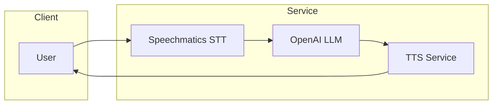

# Example Template

This document describes the standard structure and content for Academy examples.

## Directory Structure

Every example should follow this structure:

```
example-name/
├── python/
│   ├── main.py             # Primary Python implementation
│   ├── requirements.txt    # Python dependencies
│   └── .gitignore          # Ignore venv/, __pycache__/, .env
├── assets/                 # Sample files, images, etc.
│   ├── sample.wav          # Sample audio (if needed)
│   └── agent.md            # Agent prompt (for voice agents)
├── .env.example            # Environment variables template
└── README.md               # Main documentation (REQUIRED)
```

> [!NOTE]
> TypeScript examples are coming soon. For now, focus on Python implementations.

## Main README.md Template

The main README.md should follow this structure:

```markdown
# [Example Title]

**[One-line description in bold]**

[Optional: Additional context paragraph]

## What You'll Learn

- [Key concept 1]
- [Key concept 2]
- [Key concept 3]

## Prerequisites

- **Speechmatics API Key**: Get one from [portal.speechmatics.com](https://portal.speechmatics.com/)
- **Python 3.8+** (or 3.9+/3.10+ if using Voice SDK or LiveKit)
- [Any other requirements]

## Quick Start

### Python

**Step 1: Create and activate a virtual environment**

**On Windows:**
```bash
cd python
python -m venv venv
venv\Scripts\activate
```

**On Mac/Linux:**
```bash
cd python
python3 -m venv venv
source venv/bin/activate
```

**Step 2: Install dependencies**

```bash
pip install -r requirements.txt
```

**Step 3: Configure your API key**

```bash
cp ../.env.example .env
# Edit .env and add your SPEECHMATICS_API_KEY
```

> [!IMPORTANT]
> **Why `.env`?** Never commit API keys to version control. The `.env` file keeps secrets out of your code.

**Step 4: Run the example**

```bash
python main.py
```

## How It Works

> [!NOTE]
> Brief explanation of what the code does:
>
> 1. **[Step 1]**: [Description]
> 2. **[Step 2]**: [Description]
> 3. **[Step 3]**: [Description]

### Code Walkthrough

[Show key code snippets with explanations]

```python
# Example code snippet with comments
```

## Expected Output

```
[Show sample output]
```

## Key Features Demonstrated

**[Feature 1]:**
- [Brief explanation]

**[Feature 2]:**
- [Brief explanation]

## Configuration Options

[Optional section for customization examples]

```python
# Show how to modify configuration
```

## Next Steps

- **[Related Example 1](../path/)** - [Brief description]
- **[Related Example 2](../path/)** - [Brief description]

## Troubleshooting

**Error: "[Common error message]"**
- [Solution step 1]
- [Solution step 2]

**Issue: "[Common problem]"**
- [How to fix it]

## Resources

- [Speechmatics Docs](https://docs.speechmatics.com)
- [API Reference](https://docs.speechmatics.com/api-ref/)
- [Related Example](../other-example/)

---

**Time to Complete**: X minutes
**Difficulty**: Beginner | Intermediate | Advanced
**API Mode**: Batch | Real-time | Voice Agent

[Back to Academy](../../README.md)
```

## GitHub-Flavored Callouts

Use these callout styles for important information:

```markdown
> [!NOTE]
> Useful information that users should know.

> [!TIP]
> Helpful advice for doing things better or more easily.

> [!IMPORTANT]
> Key information users need to know.

> [!WARNING]
> Urgent info that needs immediate user attention.

> [!CAUTION]
> Advises about risks or negative outcomes.
```

## Integration Examples

For integration examples (LiveKit, Pipecat, Twilio, etc.), add a logo header:

```markdown
<div align="center">

<picture>
  <source media="(prefers-color-scheme: dark)" srcset="../logo/logo-dark.png">
  <source media="(prefers-color-scheme: light)" srcset="../logo/logo-light.png">
  
</picture>

# Example Title - Integration + Speechmatics

**[Bold description]**

</div>
```

### Architecture Diagrams

For integration examples, include a Mermaid architecture diagram:

```markdown
## Architecture


```

## Code File Requirements

### Python (main.py)

```python
#!/usr/bin/env python3
"""
[Example Title]

[Brief description of what this example demonstrates]
"""

import asyncio
import os
from pathlib import Path

from dotenv import load_dotenv
from speechmatics.batch import AsyncClient, AuthenticationError

# Load environment variables
load_dotenv()


async def main():
    """[Function description]."""
    api_key = os.getenv("SPEECHMATICS_API_KEY")

    # Your code here
    try:
        async with AsyncClient(api_key=api_key) as client:
            # Implementation
            pass

    except (AuthenticationError, ValueError) as e:
        print(f"\nError: {e}")


if __name__ == "__main__":
    asyncio.run(main())
```

### Key Code Style Points

- Use `#!/usr/bin/env python3` shebang for executable scripts
- Place all imports at the top (stdlib, then third-party, then local)
- Use `async/await` pattern with context managers
- Include error handling for `AuthenticationError`
- Follow PEP 8 style guidelines
- Add docstrings to functions

## .env.example Template

```bash
# Speechmatics API Key (required)
# Get yours at: https://portal.speechmatics.com/
SPEECHMATICS_API_KEY=your_api_key_here

# Optional: Additional API keys for integrations
# OPENAI_API_KEY=your_openai_key_here
# ELEVENLABS_API_KEY=your_elevenlabs_key_here
```

## requirements.txt Template

```txt
# Speechmatics SDK - choose the package for your use case:
# speechmatics-batch>=0.4.4    # For batch transcription
# speechmatics-rt>=0.2.0       # For real-time transcription
# speechmatics-voice>=0.1.27   # For voice agents

# Environment variables
python-dotenv>=1.0.0

# Example-specific dependencies
# [Add any example-specific dependencies here]
```

## Metadata Entry (index.yaml)

Add your example to `docs/index.yaml`:

```yaml
- id: "your-example-id"
  title: "Your Example Title"
  description: "One-line description"
  category: "basics|integrations|use-cases"
  difficulty: "beginner|intermediate"
  languages: ["python"]
  features:
    - "batch-transcription"
    - "realtime-transcription"
    - "voice-agents"
  integrations: []  # Or ["livekit", "pipecat", "twilio", "vapi"]
  path: "category/your-example-id"
  readme: "category/your-example-id/README.md"
  tags: ["tag1", "tag2", "tag3"]
  last_updated: "YYYY-MM-DD"
  estimated_time: "X minutes"
```

## Quality Checklist

Before submitting your example:

- [ ] README.md follows the template structure
- [ ] Python implementation works end-to-end
- [ ] .env.example includes all required variables
- [ ] requirements.txt lists all dependencies
- [ ] Code includes helpful comments
- [ ] Code follows PEP 8 style guidelines
- [ ] Error handling is demonstrated
- [ ] No hardcoded API keys or secrets
- [ ] Metadata added to docs/index.yaml
- [ ] Footer includes Time/Difficulty/API Mode
- [ ] "Back to Academy" link is correct

## Best Practices

1. **Keep it simple** - Examples should be easy to understand
2. **Show one thing well** - Focus on a single feature or integration
3. **Use real-world scenarios** - Make examples practical
4. **Include error handling** - Show how to handle common errors
5. **Add helpful comments** - Explain what each section does
6. **Test thoroughly** - Ensure it works before submitting
7. **Use callouts** - Highlight important info with `> [!NOTE]` etc.
8. **Link to docs** - Reference official documentation where relevant

## Example Naming Convention

- Use **kebab-case** for directory names
- Use **numbered prefixes** for ordering: `01-hello-world`, `02-batch-vs-realtime`
- Be **descriptive** but **concise**

**Good Examples:**
- `01-hello-world`
- `02-batch-vs-realtime`
- `01-simple-voice-assistant`

**Bad Examples:**
- `example1`
- `test`
- `my_cool_thing`

## Need Help?

- Check existing examples for reference
- Open an issue on GitHub
- Email: devrel@speechmatics.com

[Back to Academy](../README.md)
