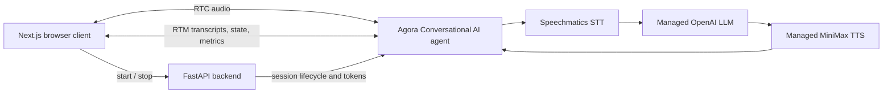

<div align="center">

<picture>
  <source media="(prefers-color-scheme: dark)" srcset="../logo/agora-logo-rgb-blue.svg">
  <source media="(prefers-color-scheme: light)" srcset="../logo/agora-logo-rgb-blue.svg">
  
</picture>

# Conversational AI Voice Agent - Agora + Speechmatics

**Build a browser-based voice agent with Agora Conversational AI and Speechmatics real-time transcription.**

</div>

This example includes a runnable Python FastAPI backend and Next.js client,
adapted from Agora's [Python quickstart](https://github.com/AgoraIO-Conversational-AI/agent-quickstart-python).
Speechmatics replaces the quickstart's default speech-to-text provider while
the managed OpenAI LLM and MiniMax TTS remain unchanged.


## What You'll Learn

- How Speechmatics fits into an Agora Conversational AI pipeline
- How the Python backend starts and stops managed Agora agent sessions
- How RTC carries audio while RTM delivers transcripts, state, and metrics
- How to keep Agora and Speechmatics credentials on the server

## Prerequisites

- **Speechmatics API Key**: Get one from [portal.speechmatics.com](https://portal.speechmatics.com/)
- **Agora project**: RTC, RTM, and Conversational AI must be enabled
- **Python 3.10+**: invoked as `python3` on Mac/Linux and `python` on Windows
- **Bun**
- **Agora CLI** (optional): writes your Agora credentials for you; Step 2 covers the manual alternative

**Install Bun:**
```bash
# macOS / Linux
curl -fsSL https://bun.com/install | bash

# Windows (PowerShell)
powershell -c "irm bun.sh/install.ps1|iex"

# Any platform, if you already have Node.js
npm install -g bun
```

**Install the Agora CLI:**
```bash
# macOS / Linux
curl -fsSL https://dl.agora.io/cli/install.sh | sh

# Windows (PowerShell)
irm https://dl.agora.io/cli/install.ps1 | iex
```

> [!NOTE]
> The Agora CLI installs a signed binary from its own installer. There is no
> Homebrew formula and no winget package, and the npm distribution is paused
> upstream - the package published there may be stale and should not be used.
> See the
> [Agora CLI documentation](https://docs.agora.io/en/introduction/agora-cli).

> [!TIP]
> **Windows execution policy.** If PowerShell refuses to run the inline
> installer, download it and run it explicitly:
>
> ```powershell
> Invoke-WebRequest -Uri https://dl.agora.io/cli/install.ps1 -OutFile .\install.ps1
> powershell -ExecutionPolicy Bypass -File .\install.ps1
> ```

## Quick Start

The implementation is in this Academy example: `server/` owns credentials,
tokens, and the agent lifecycle; `web/` owns the browser call UI. The root
`package.json` starts both processes together.

> [!NOTE]
> **Every Quick Start command is the same on Windows and Mac/Linux.** The
> `bun run` targets resolve your Python interpreter (`python3` vs `python`) and
> the virtualenv layout (`venv/bin` vs `venv\Scripts`) for you, so no step here
> needs a platform-specific variant. The prerequisite installs above and some
> Troubleshooting commands below do differ by platform.

**Step 1: Clone the Academy and enter the example**

```bash
git clone https://github.com/speechmatics/speechmatics-academy.git
cd speechmatics-academy/integrations/agora/01-conversational-ai-agent
```

**Step 2: Select and configure your Agora project**

<details>
<summary><strong>Option A: Using the Agora CLI (Recommended)</strong></summary>

```bash
agora login
agora project use <project-id-or-name>
bun run setup
agora project env write server/.env --template standard
bun run setup:env
```

Your project ID and name are listed in the
[Agora Console](https://console.agora.io/).

</details>

<details>
<summary><strong>Option B: Without the Agora CLI</strong></summary>

```bash
bun run setup
```

`bun run setup` creates `server/.env` from `server/.env.example`. Open that
file and fill in `AGORA_APP_ID` and `AGORA_APP_CERTIFICATE` from the
[Agora Console](https://console.agora.io/).

</details>

**Step 3: Add the Speechmatics key**

Add your key to `server/.env`:

```dotenv
SPEECHMATICS_API_KEY=your_real_speechmatics_api_key
```

> [!IMPORTANT]
> Keep `AGORA_APP_CERTIFICATE` and `SPEECHMATICS_API_KEY` server-side. Do not
> expose them through browser-prefixed environment variables or commit
> `server/.env`.

**Step 4: Validate and run the demo**

```bash
bun run doctor:local
agora project doctor --deep   # Agora CLI only
bun run dev
```

Open [http://localhost:3000](http://localhost:3000) and select **Start
conversation**.

## How It Works



1. The browser requests a channel configuration from FastAPI.
2. FastAPI creates a scoped RTC and RTM token and starts an Agora agent in the
   same channel.
3. Agora sends the user's audio to Speechmatics for real-time transcription.
4. The managed LLM produces a response and the managed TTS provider returns
   audio to the channel.
5. The browser renders transcripts, agent state, and latency metrics received
   over RTM.

### Speechmatics Provider Configuration

The provider swap is isolated to the agent configuration:

```python
from agora_agent.agentkit.vendors import SpeechmaticsSTT

stt = SpeechmaticsSTT(
    key=self.speechmatics_api_key,
    language="en",
    uri="wss://global.rt.speechmatics.com/v2",
    additional_params={
        "additional_vocab": [
            {"content": "Speechmatics", "sounds_like": ["speech matics", "speech mattox"]},
        ],
    },
)
```

`additional_params` is merged into the provider `params` alongside `key`,
`language`, and `uri`, so anything Speechmatics accepts in its
`transcription_config` can be passed through. This demo uses it for a custom
dictionary: recognition is accurate on clean audio, but microphone input only
reaches the provider after Opus encoding and noise suppression on the RTC leg,
where "Speechmatics" degrades to "speech Mattox". Listing the spellings you
expect keeps the live transcript readable — add your own product terms the same
way.

The demo pins `agora-agents==2.6.1` and passes the credential through `key`.
Its regression tests verify that the SDK serializes this as `params.key`, not
the deprecated `api_key` field.

See [`server/src/agent.py`](server/src/agent.py) for the provider configuration
and [`web/src/components/QuickstartPipelineMetrics.tsx`](web/src/components/QuickstartPipelineMetrics.tsx)
for the ASR/LLM/TTS latency display.

## Expected Output

After **Start conversation** is selected:

```text
Browser joins the Agora RTC channel
Agora agent starts in the same channel
Speechmatics transcribes microphone audio
Live transcript, state, and metrics appear in the browser
The agent replies with synthesized audio
```

The local services are:

| Service | URL |
| --- | --- |
| Next.js client | `http://localhost:3000` |
| FastAPI backend | `http://localhost:8000` |
| FastAPI API docs | `http://localhost:8000/docs` |

## Configuration Options

| Variable | Required | Purpose |
| --- | --- | --- |
| `AGORA_APP_ID` | Yes | Agora project identifier |
| `AGORA_APP_CERTIFICATE` | Yes | Server-side Agora token credential |
| `SPEECHMATICS_API_KEY` | Yes | Server-side Speechmatics STT credential |
| `AGENT_GREETING` | No | Overrides the agent's opening message |
| `PORT` | No | FastAPI port; defaults to `8000` |
| `AGENT_BACKEND_URL` | Deployment only | Public FastAPI URL used by the Next.js server |

Process environment variables take precedence over values in `server/.env`.
For lower latency, change the Speechmatics `uri` to the real-time endpoint
closest to your users.

## Verification

The demo includes backend unit tests, browser helper tests, API contract checks,
and a production web build. Run these from the example root after `bun run setup`:

```bash
bun run test:backend          # backend unit tests
bun run verify:backend        # byte-compile the backend sources
cd web && bun test && cd ..   # browser helper tests
bun run verify:web            # prerequisites, API contracts, production build
```

With real credentials configured, run the full local verification chain:

```bash
bun run verify:local
```

## Troubleshooting

**Doctor reports a missing Speechmatics key**

- Add a real `SPEECHMATICS_API_KEY` to `server/.env`.
- Run `bun run setup:env`, then `bun run doctor:local` again.

**The agent does not join the channel**

- Confirm RTC, RTM, and Conversational AI are enabled for the selected project.
- Run `agora project doctor --deep` and inspect the FastAPI logs.

**Browser API requests return 404**

- Confirm the FastAPI process is running on port `8000`.
- For deployment, set `AGENT_BACKEND_URL` for the Next.js server to the public
  FastAPI URL.
- Set `AGENT_BACKEND_URL` when you **build**, not only when you start.
  `web/next.config.ts` reads it inside `rewrites()`, and Next evaluates that at
  build time: if the variable was unset then, the `/api/*` rewrites are baked
  out of the build and every request returns 404 even though the variable is
  present at runtime. Rebuild with it set:

```bash
cd web && AGENT_BACKEND_URL=https://your-backend.example.com bun run build
```

  `bun run dev` is unaffected, because `dev:frontend` sets the variable inline
  before starting Next.

**A supported Python was not found**

- Install Python 3.10 or newer, then reopen your terminal so `PATH` updates.
- If you keep Python somewhere non-standard, point the project straight at it:

```bash
# macOS / Linux
QUICKSTART_PYTHON=/usr/local/bin/python3.12 bun run setup

# Windows (PowerShell)
$env:QUICKSTART_PYTHON = "C:\Python312\python.exe"; bun run setup
```

**The backend virtualenv is unusable**

- Re-run `bun run setup:backend` first - it finishes an interrupted dependency
  install without touching the environment.
- If the environment itself is broken, `bun run setup:backend --recreate`
  deletes and recreates `server/venv` from scratch.
- A healthy `server/venv` is never rebuilt automatically, and one holding
  installed packages is never deleted without `--recreate`.

**Port 3000 or 8000 is already in use**

A stale listener on `3000` makes Next.js start on another port, so the page you
open at `localhost:3000` is not this demo. A stale listener on `8000` makes
`AGENT_BACKEND_URL=http://localhost:8000` point at the wrong backend. Stop the
old process before restarting:

```bash
# macOS / Linux
kill -9 $(lsof -ti:3000)
kill -9 $(lsof -ti:8000)

# Windows (PowerShell)
Get-NetTCPConnection -LocalPort 3000 -State Listen | ForEach-Object { Stop-Process -Id $_.OwningProcess -Force }
Get-NetTCPConnection -LocalPort 8000 -State Listen | ForEach-Object { Stop-Process -Id $_.OwningProcess -Force }
```

**The agent greets you but never hears you**

- Allow microphone access when the browser prompts; Agora's RTC client reports
  `PERMISSION_DENIED` and sends no audio if it is blocked.
- Sandboxed or embedded browser panes usually deny capture outright. Use a
  normal browser window to test speech.

## Resources

- [Agora Python demo](https://github.com/AgoraIO-Conversational-AI/agent-quickstart-python)
- [Included backend guide](server/README.md)
- [Included architecture guide](ARCHITECTURE.md)
- [Quickstart license](LICENSE)
- [Agora Conversational AI documentation](https://docs.agora.io/en/conversational-ai/overview/product-overview)
- [Speechmatics documentation](https://docs.speechmatics.com/)
- [Speechmatics Portal](https://portal.speechmatics.com/)

---

## Feedback

Help us improve this guide:

- Found an issue? [Report it](https://github.com/speechmatics/speechmatics-academy/issues)
- Have suggestions? [Open a discussion](https://github.com/orgs/speechmatics/discussions/categories/academy)

---

**Time to Complete**: 20 minutes
**Difficulty**: Intermediate
**API Mode**: Voice Agent

[Back to Integrations](../../) | [Back to Academy](../../../README.md)
