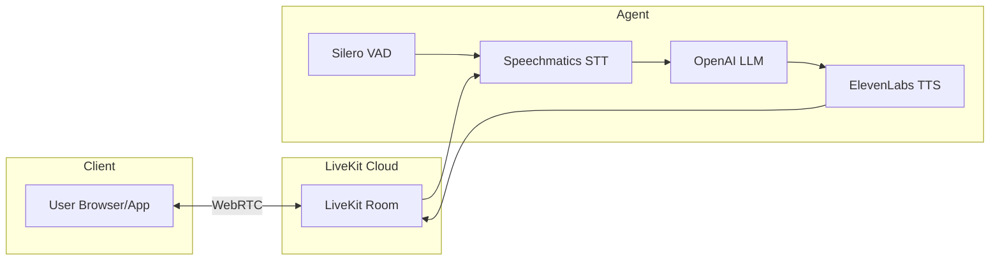

<div align="center">

<picture>
  <source media="(prefers-color-scheme: dark)" srcset="../logo/LK_wordmark_darkbg.png">
  <source media="(prefers-color-scheme: light)" srcset="../logo/LK_wordmark_lightbg.png">
  
</picture>

# Simple Voice Assistant - LiveKit + Speechmatics

**Build a conversational voice assistant using LiveKit Agents with Speechmatics speech recognition.**

</div>

A complete voice assistant using LiveKit's real-time WebRTC infrastructure with best-in-class speech recognition (Speechmatics), natural language processing (OpenAI), and text-to-speech (ElevenLabs).

## What You'll Learn

- How to integrate Speechmatics STT with LiveKit Agents
- Building a complete voice assistant with WebRTC
- Using LiveKit's agent framework for real-time conversations
- Voice Activity Detection (VAD) for natural turn-taking
- Filtering background audio using speaker diarization and focus speakers

## Prerequisites

- **Speechmatics API Key**: Get one from [portal.speechmatics.com](https://portal.speechmatics.com/)
- **OpenAI API Key**: Get one from [platform.openai.com](https://platform.openai.com/)
- **ElevenLabs API Key**: Get one from [elevenlabs.io](https://elevenlabs.io/)
- **LiveKit Cloud Account**: Get one from [cloud.livekit.io](https://cloud.livekit.io/)
- **Python 3.10+**

## Quick Start

> [!TIP]
> **Using a remote VM?** Console mode requires local microphone access. If you're running on a remote server, use `python main.py dev` and connect via the [LiveKit Agents Playground](https://agents-playground.livekit.io) instead. See [Testing with the Agents Playground](#testing-with-the-agents-playground) for details.

### Python

**Step 1: Create and activate a virtual environment**

**On Windows:**
```bash
cd python
python -m venv venv
venv\Scripts\activate
```

**On Mac/Linux:**
```bash
cd python
python3 -m venv venv
source venv/bin/activate
```

**Step 2: Install dependencies**

```bash
pip install -r requirements.txt
```

**Step 3: Configure your API keys**

<details>
<summary><strong>Option A: Using LiveKit CLI (Recommended)</strong></summary>

The [LiveKit CLI](https://docs.livekit.io/home/cli/) simplifies credential management:

**Install the CLI:**
```bash
# macOS
brew install livekit-cli

# Windows
winget install LiveKit.LiveKitCLI

# Linux
curl -sSL https://get.livekit.io/cli | bash
```

**Authenticate and load credentials:**
```bash
lk cloud auth        # Opens browser to authenticate with LiveKit Cloud
lk app env -w        # Writes LiveKit credentials to .env.local
```

Then add your other API keys to `.env.local`:
```
SPEECHMATICS_API_KEY=your_speechmatics_api_key_here
OPENAI_API_KEY=your_openai_api_key_here
ELEVEN_API_KEY=your_elevenlabs_api_key_here
```

</details>

<details open>
<summary><strong>Option B: Manual Configuration</strong></summary>

```bash
cp ../.env.example .env
```

Open the `.env` file and add your API keys:

```
SPEECHMATICS_API_KEY=your_speechmatics_api_key_here
OPENAI_API_KEY=your_openai_api_key_here
ELEVEN_API_KEY=your_elevenlabs_api_key_here
LIVEKIT_URL=wss://your-project.livekit.cloud
LIVEKIT_API_KEY=your_livekit_api_key_here
LIVEKIT_API_SECRET=your_livekit_api_secret_here
```

</details>

> [!NOTE]
> LiveKit's ElevenLabs plugin uses `ELEVEN_API_KEY` (not `ELEVENLABS_API_KEY`).

> [!IMPORTANT]
> **Why `.env`?** Never commit API keys to version control. The `.env` file keeps secrets out of your code.

**Step 4: Run the agent**

For local development with console mode:
```bash
python main.py console
```

For development server (connects to LiveKit Cloud):
```bash
python main.py dev
```

## Architecture



## How It Works

### Pipeline Components

1. **LiveKit Room** - WebRTC connection for real-time audio/video
2. **Speechmatics STT** - Transcribes speech to text with diarization
3. **OpenAI LLM** - Generates intelligent responses
4. **ElevenLabs TTS** - Converts text responses to natural speech
5. **Silero VAD** - Voice Activity Detection for turn-taking

### Key Features

| Feature | Description |
|---------|-------------|
| **WebRTC** | Real-time audio streaming via LiveKit infrastructure |
| **Diarization** | Speaker identification to distinguish different speakers |
| **Focus Speakers** | Filter to only respond to the primary user (S1) |
| **Passive Filtering** | Background audio (TV, radio) marked as passive and ignored by LLM |
| **VAD** | Silero Voice Activity Detection for natural turn-taking |
| **Auto Greeting** | Agent greets user when session starts |
| **Cloud Ready** | Deploy to LiveKit Cloud for production |

### Code Highlights

```python
from livekit.agents import AgentSession, Agent
from livekit.plugins import speechmatics, openai, elevenlabs, silero

class VoiceAssistant(Agent):
    def __init__(self) -> None:
        super().__init__(instructions="You are Roxie, a hilarious standup comedian...")

async def entrypoint(ctx: agents.JobContext):
    await ctx.connect()

    session = AgentSession(
        stt=speechmatics.STT(
            enable_diarization=True,
            speaker_active_format="<{speaker_id}>{text}</{speaker_id}>",
            speaker_passive_format="<PASSIVE><{speaker_id}>{text}</{speaker_id}></PASSIVE>",
            focus_speakers=["S1"],
        ),
        llm=openai.LLM(model="gpt-4o-mini"),
        tts=elevenlabs.TTS(voice_id="21m00Tcm4TlvDq8ikWAM"),
        vad=silero.VAD.load(),
    )

    await session.start(room=ctx.room, agent=VoiceAssistant())
    await session.generate_reply(instructions="Say hello...")
```

## Expected Output

```
INFO     | Starting agent...
INFO     | Connected to LiveKit room

Roxie: "Hey there! Roxie here, ready to make you laugh. What's on your mind?"

You: "Tell me a joke"
Roxie: "So I told my wife she was drawing her eyebrows too high... She looked surprised!"

You: "That's terrible"
Roxie: "Um... yeah, I know. But you still laughed a little, didn't you?"
```

## Customization

### Change the Voice

Edit the `voice_id` parameter in `main.py`:

```python
tts = elevenlabs.TTS(
    voice_id="your_voice_id_here",  # Find voices at elevenlabs.io
)
```

### Customize the Agent Prompt

Edit `assets/agent.md` to change the assistant's personality and capabilities. The default prompt configures Roxie as a standup comedian with:

- Witty banter and snappy responses
- Natural hesitations (um, uh) for realistic speech
- Multi-speaker awareness (active listener in group conversations)
- Spoken format optimizations (no emojis, numbers as words, expanded acronyms)

### Speaker Diarization & Background Filtering

The STT is configured to identify speakers and filter background audio:

```python
stt = speechmatics.STT(
    enable_diarization=True,
    speaker_active_format="<{speaker_id}>{text}</{speaker_id}>",
    speaker_passive_format="<PASSIVE><{speaker_id}>{text}</{speaker_id}></PASSIVE>",
    focus_speakers=["S1"],
)
```

| Parameter | Purpose |
|-----------|---------|
| `enable_diarization` | Identify different speakers in the audio |
| `speaker_active_format` | Format for the focused speaker: `<S1>Hello</S1>` |
| `speaker_passive_format` | Format for background audio: `<PASSIVE><S2>...</S2></PASSIVE>` |
| `focus_speakers` | Only treat S1 (first speaker) as active; others are passive |

**How it works:**
1. The first person to speak is assigned `S1` (the primary user)
2. Other speakers (TV, radio, people nearby) are marked as passive
3. The agent prompt (`assets/agent.md`) instructs the LLM to ignore `<PASSIVE>` content
4. In multi-speaker scenarios, Roxie acts as an active listener and only joins when invited

This prevents the assistant from responding to background conversations or media playing nearby.

## Running Modes

| Mode | Command | Description |
|------|---------|-------------|
| **Console** | `python main.py console` | Local testing with microphone |
| **Dev** | `python main.py dev` | Connects to LiveKit Cloud for testing |
| **Production** | `python main.py start` | Production deployment |

## Testing with the Agents Playground

The [LiveKit Agents Playground](https://agents-playground.livekit.io) is a web-based interface for testing your voice assistant without building a custom frontend.

**Step 1: Start your agent in dev mode**

```bash
python main.py dev
```

**Step 2: Open the Agents Playground**

Visit [agents-playground.livekit.io](https://agents-playground.livekit.io) in your browser.

**Step 3: Connect to your LiveKit Cloud project**

1. Click **Connect** and sign in with your LiveKit Cloud account
2. Select your project from the dropdown
3. The playground will automatically connect to your running agent

**Step 4: Start talking**

- Click the microphone button to enable audio
- Speak to Roxie and see real-time transcription
- The playground supports audio, video, and text input

> [!TIP]
> The playground shows live transcription, audio visualization, and agent responses - perfect for debugging speaker diarization and passive filtering.

## Troubleshooting

**Exception on Ctrl+C (Windows)**
- You may see a `KeyboardInterrupt` exception from the threading module when stopping the agent
- This is a cosmetic issue in the LiveKit Agents CLI on Windows
- The agent stops correctly despite the error message

**Error: "Invalid API key"**
- Verify all API keys in your `.env` file
- Check each service's portal for key validity

**Agent doesn't connect**
- Check `LIVEKIT_URL`, `LIVEKIT_API_KEY`, and `LIVEKIT_API_SECRET`
- Verify your LiveKit Cloud project is active

**No audio input detected**
- Check your microphone permissions in the browser
- Ensure the LiveKit room is properly connected

**Agent doesn't respond**
- Check OpenAI API key is valid
- Verify you have API credits available

## Next Steps

- **[Voice Agent Turn Detection](../../../basics/08-voice-agent-turn-detection/)** - Learn about turn detection presets
- **[Voice Agent Speaker ID](../../../basics/09-voice-agent-speaker-id/)** - Advanced speaker identification

## Resources

- [LiveKit Agents Documentation](https://docs.livekit.io/agents/)
- [LiveKit Speechmatics Plugin](https://docs.livekit.io/agents/models/stt/plugins/speechmatics/)
- [Speechmatics API Docs](https://docs.speechmatics.com/)
- [ElevenLabs API Docs](https://elevenlabs.io/docs)
- [OpenAI API Docs](https://platform.openai.com/docs)

---

## Feedback

Help us improve this guide:
- Found an issue? [Report it](https://github.com/speechmatics/speechmatics-academy/issues)
- Have suggestions? [Open a discussion](https://github.com/orgs/speechmatics/discussions/categories/academy)

---

**Time to Complete**: 15 minutes
**Difficulty**: Intermediate
**Integration**: LiveKit Agents

[Back to Integrations](../../) | [Back to Academy](../../../README.md)
