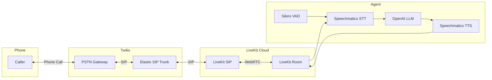

<div align="center">

<picture>
  <source media="(prefers-color-scheme: dark)" srcset="../logo/LK_wordmark_darkbg.png">
  <source media="(prefers-color-scheme: light)" srcset="../logo/LK_wordmark_lightbg.png">
  
</picture>

# Telephony Voice Assistant - Twilio + LiveKit + Speechmatics

**Build a conversational voice assistant for phone calls using LiveKit SIP with Twilio and Speechmatics speech recognition and text-to-speech.**

</div>

A complete voice assistant that handles inbound phone calls using LiveKit's SIP integration with Twilio, best-in-class speech recognition (Speechmatics STT), natural language processing (OpenAI), and text-to-speech (Speechmatics TTS).

## What You'll Learn

- How to integrate Speechmatics STT and TTS with LiveKit Agents for telephony
- Setting up Twilio Elastic SIP Trunking with LiveKit
- Handling inbound phone calls with LiveKit SIP
- Using LiveKit's agent framework for phone-based conversations
- Voice Activity Detection (VAD) for natural turn-taking

## Prerequisites

- **Speechmatics API Key**: Get one from [portal.speechmatics.com](https://portal.speechmatics.com/)
- **OpenAI API Key**: Get one from [platform.openai.com](https://platform.openai.com/)
- **LiveKit Cloud Account**: Get one from [cloud.livekit.io](https://cloud.livekit.io/)
- **Twilio Account**: Get one from [twilio.com](https://www.twilio.com/)
- **Twilio Phone Number**: Purchase a phone number in the Twilio Console
- **Python 3.10+**

## Quick Start

### Python

**Step 1: Create and activate a virtual environment**

**On Windows:**

```bash
cd python
python -m venv venv
venv\Scripts\activate
```

**On Mac/Linux:**

```bash
cd python
python3 -m venv venv
source venv/bin/activate
```

**Step 2: Install dependencies**

```bash
pip install -r requirements.txt
```

**Step 3: Configure your API keys**

```bash
cp ../.env.example .env
```

Open the `.env` file and add your API keys:

```
SPEECHMATICS_API_KEY=your_speechmatics_api_key_here
OPENAI_API_KEY=your_openai_api_key_here
LIVEKIT_URL=wss://your-project.livekit.cloud
LIVEKIT_API_KEY=your_livekit_api_key_here
LIVEKIT_API_SECRET=your_livekit_api_secret_here
```

> [!IMPORTANT]
> **Why `.env`?** Never commit API keys to version control. The `.env` file keeps secrets out of your code.

**Step 4: Configure Twilio SIP Trunk**

See [Twilio + LiveKit SIP Setup](#twilio--livekit-sip-setup) below.

**Step 5: Run the agent**

```bash
python main.py dev
```

**Step 6: Call your Twilio number**

Call your Twilio phone number and start talking to Roxie!

## Architecture



## How It Works

### Pipeline Flow

1. **Incoming Call** - Caller dials your Twilio phone number
2. **SIP Routing** - Twilio routes call via SIP to LiveKit
3. **Room Connection** - LiveKit SIP creates a room participant for the caller
4. **Speech-to-Text** - Speechmatics transcribes the caller's speech
5. **LLM Processing** - OpenAI generates a response
6. **Text-to-Speech** - Speechmatics converts response to audio
7. **Audio Playback** - Audio streams back through LiveKit SIP to the caller

### Key Components

| Component              | Description                                            |
| ---------------------- | ------------------------------------------------------ |
| **LiveKit Agents**     | Framework for building real-time voice AI applications |
| **LiveKit SIP**        | Bridges PSTN calls to LiveKit rooms via SIP            |
| **Twilio Elastic SIP** | Routes phone calls to LiveKit's SIP endpoint           |
| **Speechmatics STT**   | Real-time speech-to-text transcription                 |
| **OpenAI GPT-4o-mini** | Language model for generating responses                |
| **Speechmatics TTS**   | Text-to-speech for natural voice output                |
| **Silero VAD**         | Voice Activity Detection for turn-taking               |

### Code Highlights

```python
from livekit.agents import AgentSession, Agent
from livekit.plugins import speechmatics, openai, silero

class VoiceAssistant(Agent):
    def __init__(self) -> None:
        super().__init__(instructions="You are Roxie, a hilarious standup comedian...")

async def entrypoint(ctx: agents.JobContext):
    await ctx.connect()

    session = AgentSession(
        stt=speechmatics.STT(turn_detection_mode=speechmatics.TurnDetectionMode.EXTERNAL),
        llm=openai.LLM(model="gpt-4o-mini"),
        tts=speechmatics.TTS(),
        vad=silero.VAD.load(),
        turn_detection="vad"
    )

    await session.start(room=ctx.room, agent=VoiceAssistant())

    @session.on("user_state_changed")
    def on_user_state(state):
        if state.new_state == "listening" and state.old_state == "speaking":
            session.stt.finalize()

    await session.generate_reply(instructions="Say hello...")
```

## Twilio + LiveKit SIP Setup

### Step 1: Create LiveKit Inbound Trunk

First, create a SIP trunk in LiveKit to receive calls:

1. Go to [LiveKit Cloud Console](https://cloud.livekit.io/)
2. Navigate to **Telephony Configuration** > **SIP Trunks**
3. Click **Create SIP Trunk**
4. Configure:
   - **Trunk name**: Give it a name (e.g., "Twilio Inbound")
   - **Trunk direction**: Select **Inbound**
   - **Numbers**: Enter your Twilio phone number (e.g., `+14155551234`)
   - **Allowed addresses**: Leave as `0.0.0.0/0` to allow all IPs
5. Click **Create** and copy the **SIP URI** (e.g., `sip:xxxxx.sip.livekit.cloud`)

### Step 2: Create Twilio Elastic SIP Trunk

1. Go to [Twilio Console](https://console.twilio.com/)
2. Navigate to **Elastic SIP Trunking** > **Trunks**
3. Click **Create new SIP Trunk**
4. Give it a name (e.g., "LiveKit Voice Assistant")

### Step 3: Configure Twilio Origination (Inbound Calls)

Point Twilio to your LiveKit SIP endpoint:

1. In your Twilio SIP trunk, go to **Origination**
2. Add an **Origination URI**:
   - **Origination SIP URI**: Paste the LiveKit SIP URI from Step 1
   - **Priority**: 1
   - **Weight**: 1
   - **Enabled**: Yes
3. Save the configuration

### Step 4: Associate Phone Number in Twilio

1. In your Twilio SIP trunk, go to **Phone Numbers**
2. Click **Add a Phone Number**
3. Select your Twilio phone number
4. Save the configuration

### Step 5: Create LiveKit Dispatch Rule

Route incoming calls to your agent:

1. Go to [LiveKit Cloud Console](https://cloud.livekit.io/)
2. Navigate to **Telephony Configuration** > **Dispatch Rules**
3. Click **Create Dispatch Rule**
4. Configure:
   - **Trunk**: Select the inbound trunk you created in Step 1
   - **Rule Type**: Individual (creates a room per call)
   - **Room Prefix**: `call-` (or any prefix you prefer)
5. Save the configuration

## Customization

### Customize the Agent Prompt

Edit `assets/agent.md` to change the assistant's personality. The default configures Roxie as a standup comedian optimized for phone conversations.

### Enable Noise Cancellation

For better call quality, enable Krisp noise cancellation in your LiveKit dispatch rule:

1. Go to [LiveKit Cloud Console](https://cloud.livekit.io/)
2. Navigate to **Telephony Configuration** > **Dispatch Rules**
3. Select your dispatch rule and click **Edit**
4. Add `krispEnabled: true` to the `roomConfig` object:

```json
{
  "sipDispatchRuleId": "SDR_yourRuleId",
  "rule": {
    "dispatchRuleIndividual": {
      "roomPrefix": "call-"
    }
  },
  "trunkIds": ["ST_yourTrunkId"],
  "name": "Your Rule Name",
  "roomConfig": {
    "krispEnabled": true
  }
}
```

This enables Krisp AI noise cancellation, which filters out background noise from the caller's phone for clearer audio to your STT.

## Running Modes

| Mode           | Command                  | Description                              |
| -------------- | ------------------------ | ---------------------------------------- |
| **Dev**        | `python main.py dev`     | Connects to LiveKit Cloud for testing    |
| **Console**    | `python main.py console` | Local testing with microphone (no phone) |
| **Production** | `python main.py start`   | Production deployment                    |

## Comparison: LiveKit SIP vs Direct Twilio Media Streams

| Feature              | LiveKit SIP (This Sample) | Direct Twilio (01-voice-assistant) |
| -------------------- | ------------------------- | ---------------------------------- |
| **Infrastructure**   | LiveKit Cloud handles SIP | Your server handles WebSocket      |
| **Scaling**          | Built-in via LiveKit      | Manual server scaling              |
| **Audio Format**     | Handled by LiveKit        | Manual mulaw conversion            |
| **Setup Complexity** | SIP trunk configuration   | Webhook + ngrok setup              |
| **Best For**         | Production deployments    | Learning/prototyping               |

## Troubleshooting

**Error: "Invalid API key"**

- Verify all API keys in your `.env` file
- Check each service's portal for key validity

**Calls not connecting**

- Verify Twilio SIP trunk origination URI is correct
- Check LiveKit dispatch rules are configured
- Ensure LiveKit API credentials are valid

**Agent doesn't respond**

- Check OpenAI API key is valid
- Verify you have API credits available

**No audio heard by caller**

- Check Speechmatics API key
- Verify TTS is generating audio in logs

## Next Steps

- **[Simple Voice Assistant - LiveKit](../01-simple-voice-assistant/)** - WebRTC-based voice assistant
- **[Voice Assistant - Direct Twilio](../../twilio/01-voice-assistant/)** - Compare with direct Twilio integration

## Resources

- [LiveKit SIP Documentation](https://docs.livekit.io/sip/)
- [LiveKit Agents Documentation](https://docs.livekit.io/agents/)
- [Twilio Elastic SIP Trunking](https://www.twilio.com/docs/sip-trunking)
- [Configuring Twilio Trunk for LiveKit](https://docs.livekit.io/sip/quickstarts/configuring-twilio-trunk/)
- [Speechmatics API Docs](https://docs.speechmatics.com/)
- [OpenAI API Docs](https://platform.openai.com/docs)

---

## Feedback

Help us improve this guide:

- Found an issue? [Report it](https://github.com/speechmatics/speechmatics-academy/issues)
- Have suggestions? [Open a discussion](https://github.com/orgs/speechmatics/discussions/categories/academy)

---

**Time to Complete**: 30 minutes
**Difficulty**: Advanced
**Integration**: LiveKit + Twilio SIP

[Back to Integrations](../../) | [Back to Academy](../../../README.md)
