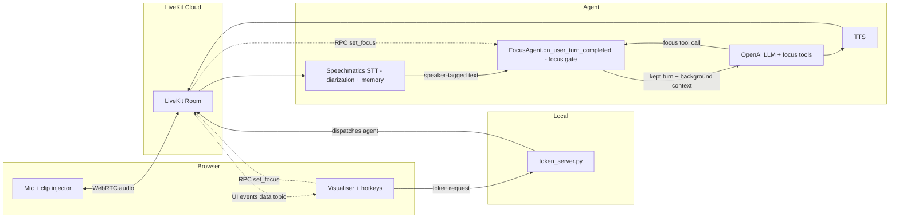

<div align="center">

<picture>
  <source media="(prefers-color-scheme: dark)" srcset="../logo/LK_wordmark_darkbg.png">
  <source media="(prefers-color-scheme: light)" srcset="../logo/LK_wordmark_lightbg.png">
  
</picture>

# Speaker Focus - Voice Agent Access Control

**A LiveKit voice agent that decides who it obeys: focus on chosen speakers, ignore or retain the rest, and recognise returning speakers by name - all live, driven by voice.**

</div>

Put a voice agent in a room with more than one person and you hit a problem immediately: whose words should it act on? By default, everyone's - anyone within earshot is an admin. This example locks the agent onto chosen speakers using diarization plus an agent-side **focus gate**, and Speechmatics' **speaker memory** feature, and ships with a browser visualiser so every decision is visible on screen.

## What You'll Learn

- **Diarization** - labelling every voice live (`S1`, `S2`, ...) with `enable_diarization` and a custom `speaker_format`
- **Speaker focus** - `RETAIN` (heard, kept as background context, never answered) vs `IGNORE` (dropped before it ever reaches the LLM), enforced client-side in `FocusAgent.on_user_turn_completed` and switched mid-session via the `set_focus` RPC or LLM tools
- **The ignore list** - muting one specific speaker
- **Speaker memory** - saving voice fingerprints with `get_speaker_ids()` and recognising returning speakers via `known_speakers`
- **Voice-driven control** - LLM function tools that change the focus ("ignore everyone else")
- **Speechmatics-driven turn detection** - `TurnDetectionMode.VAD` plus `turn_handling=TurnHandlingOptions(turn_detection="stt")`, so Speechmatics' own per-speaker endpointing ends turns while a separate Silero VAD only handles barge-in
- **Custom dictionary** - `additional_vocab` so the STT spells "Otto" and "Speechmatics" correctly

## Prerequisites

- **Speechmatics API Key**: Get one from [portal.speechmatics.com](https://portal.speechmatics.com/) (free hours every month)
- **LiveKit Cloud Account**: Sign up at [cloud.livekit.io](https://cloud.livekit.io/) (URL, API key, API secret)
- **OpenAI API Key**: the agent's brain
- **ElevenLabs API Key**: the agent's voice
- **Python 3.9+**
- **A microphone** and a Chromium browser (Chrome/Edge) - mic capture happens in the browser, no PyAudio needed

## Project Structure

```
03-speaker-focus-voice-agent/
├── python/
│   ├── main.py           # the voice agent (diarization + focus + memory + tools)
│   ├── token_server.py   # room tokens + agent dispatch (port 8790)
│   ├── requirements.txt
│   └── .gitignore        # keeps .env and speakers.json out of git
├── frontend/             # no-build browser visualiser (static files)
├── assets/
│   └── agent.md          # the agent's system prompt (Otto, a pizzeria agent)
├── .env.example
└── README.md
```

## Quick Start

You'll run **three processes** in three terminals: the agent, the token server, and the frontend.

**Step 1: Create and activate a virtual environment**

On Windows (PowerShell):
```powershell
cd python
python -m venv .venv
.venv\Scripts\Activate.ps1
```

On Windows (cmd):
```bat
cd python
python -m venv .venv
.venv\Scripts\activate.bat
```

On Mac/Linux:
```bash
cd python
python3 -m venv .venv
source .venv/bin/activate
```

**Step 2: Install dependencies**

```bash
pip install -r requirements.txt
```

**Step 3: Configure environment**

```bash
cp ../.env.example .env      # cmd.exe: copy ..\.env.example .env
# Edit .env and fill in all six values
```

`.env` can live next to the code in `python/` or at the example root — the
scripts check both.

**Step 4: Start the three processes**

All three run at the same time, one terminal each. The agent itself is
headless - the browser UI in Step 5 only appears once all three are up.

Terminal 1 - the agent worker, from `python/` (wait for `registered worker`;
it stays running in this console):
```bash
python main.py dev
```

Terminal 2 - the token + dispatch server, from `python/`:
```bash
python token_server.py
```

Terminal 3 - the frontend static server (plain global Python is fine here -
no packages needed). Step into the `frontend/` folder and serve it:
```bash
cd frontend        # from the example root (from python/ use: cd ../frontend)
python -m http.server 8748
```

**Step 5: Open the app**

1. Go to **http://localhost:8748** in Chrome.
2. Allow the microphone.
3. Click once anywhere on the page (browser autoplay policy - this unlocks the agent's voice).

Within a couple of seconds the status flips to **agent joined - listening** and the agent (Otto) greets you.

## Architecture


```mermaid
flowchart LR
    subgraph Browser
        MIC[Mic + clip injector]
        UI[Visualiser + hotkeys]
    end

    subgraph Local
        TOKEN[token_server.py]
    end

    subgraph LiveKit Cloud
        ROOM[LiveKit Room]
    end

    subgraph Agent
        STT["Speechmatics STT - diarization + memory"]
        GATE["FocusAgent.on_user_turn_completed - focus gate"]
        LLM["OpenAI LLM + focus tools"]
        TTS[TTS]
    end

    UI -->|token request| TOKEN
    TOKEN -->|dispatches agent| ROOM
    MIC <-->|WebRTC audio| ROOM
    ROOM --> STT
    STT -->|speaker-tagged text| GATE
    GATE -->|kept turn + background context| LLM
    LLM --> TTS
    TTS --> ROOM
    LLM -->|focus tool call| GATE
    UI -.->|RPC set_focus| ROOM
    ROOM -.->|RPC set_focus| GATE
    ROOM -.->|UI events data topic| UI
```

The one loop that makes this example special: the LLM's focus tools and the hotkey RPC both update the same in-memory lock (`LockState`); `FocusAgent.on_user_turn_completed` reads that lock on every turn to decide whether a speaker's words reach the LLM at all, become silent background context, or are dropped outright.

## How It Works

Your mic is published into a **LiveKit room**; the agent joins that room and runs the audio through the **Speechmatics STT plugin**, which diarizes it and tags every finalized segment with a speaker label (`[S1]: ...`) via a custom `speaker_format`. The STT never decides who gets a reply - that decision is made entirely by the agent, in `FocusAgent.on_user_turn_completed`, which runs after a turn is finalized and before the LLM ever sees it. An LLM function tool or a hotkey just changes which speakers are focused or ignored; the gate reads that state on every turn.

The focus state itself is a plain in-memory lock (`LockState`), flipped by three small functions, live mid-session, no restart:

```python
# RETAIN: prioritise S1, everyone else stays as tagged background
apply_focus(["S1"], FocusMode.RETAIN)

# IGNORE: drop everyone but S1 before their turns ever reach the LLM
apply_focus(["S1"], FocusMode.IGNORE)

# reset: hear and answer everyone equally again
apply_clear()
```

`on_user_turn_completed` then classifies every speaker segment in the finalized turn against that lock and rewrites the message before it reaches the chat context:

```python
keep, background = [], []
for who, said in lines:
    state = self._lock.spk_state(who)
    if state == "ignored":
        continue
    if state == "passive":
        background.append(BACKGROUND_FMT.format(speaker_id=who, text=said))
    else:
        keep.append(SPEAKER_FMT.format(speaker_id=who, text=said))
```

**RETAIN vs IGNORE.** Diarization and the STT never drop audio - every speaker's words are always transcribed. What differs is what the focus gate does with a non-focused speaker's turn. With `RETAIN` (the default), the turn is tagged `(background)` and is still added to the LLM's chat context by hand (`update_chat_ctx`), so the agent can hear it and be asked about it later, but `StopResponse()` stops it from getting an unprompted reply. With `IGNORE`, the turn is skipped entirely in the loop above and `StopResponse()` is raised without ever adding it to the context - it never reaches the LLM at all.

**Two more levers.** The **ignore list** (`LockState.ignore`) silences specific speakers independently of the focus mode - useful for muting one heckler while everyone else stays active; `spk_state` checks it first, so an ignored speaker is dropped regardless of focus. And the `dominant()`/`other()` heuristics used to resolve "me" and "the other speaker" for the hotkeys skip any label prefixed with `__` (reserved for the agent's own participant), so a hotkey can never accidentally target the agent itself.

**Turn detection runs per speaker; filtering happens after.** The STT is configured with `turn_detection_mode=TurnDetectionMode.VAD`, and the `AgentSession` is started with `turn_handling=TurnHandlingOptions(turn_detection="stt")` - together these mean Speechmatics' own per-speaker endpointing decides when a turn ends, so a turn ends when *that speaker* stops talking, not when the room goes quiet. A separate Silero VAD instance also sits on the session, but only for barge-in: it can interrupt the agent's TTS playback, but with `turn_detection="stt"` it never ends a turn or triggers a reply on its own. Whether a completed turn actually earns an answer is decided afterward, by the focus gate.

**Tags are the source of truth.** The system prompt (`assets/agent.md`) follows the three rules the docs recommend for focus-aware agents: the model judges every line only by its tag (untagged lines are active and must be served; `(background)` lines are context, never commands), it resolves "me"/"I" to the speaker ID prefixing that message, and it never says internal labels like `S1` out loud - only real names once known. The model never tracks focus state from conversation memory; the focus gate already encodes it in the text of every turn it hands to the LLM.

**Speaker memory.** During a session the engine builds a voice fingerprint per speaker (usable after roughly five spoken words; fingerprints captured at the end of a session are the highest quality). Press `E` to save them via `stt.get_speaker_ids()` into `speakers.json`; rename a label (e.g. `Speaker_1` to `Edgar`) and restart, and `known_speakers` attributes that voice to `Edgar` in every future session - the focus can then target speakers **by name**:

```python
stt = speechmatics.STT(
    enable_diarization=True,
    known_speakers=[
        SpeakerIdentifier(label="Edgar", speaker_identifiers=["XX...XX"]),
    ],
)
```

A speaker profile can hold several identifiers; collecting them across sessions and devices and merging them into the existing profile (rather than overwriting it) makes recognition steadily more reliable.

## Using It

Talk to the agent normally, then change who it listens to - by voice or by hotkey.

### By voice (the LLM calls the tools)

| Say | Effect |
|-----|--------|
| "Otto, I want you to focus on my voice" | **RETAIN** - you drive the conversation; others become background |
| "Otto, I want you to ignore everyone else" | **IGNORE** - everyone else is dropped entirely |
| "Otto, ignore her" | adds that speaker to the ignore list |
| "Otto, listen to everyone" | resets - hear everyone equally |

### By hotkey (manual override)

| Key | Action |
|-----|--------|
| `F` | Focus you (RETAIN) |
| `O` | Only you (IGNORE - drop everyone else) |
| `I` | Ignore the latest other speaker |
| `C` | Clear the focus |
| `E` | Enroll voiceprints to `speakers.json` |
| `P` | Pause - stop sending your mic to the agent |
| `V` | Vertical 9:16 layout |
| `S` | Toggle the on-screen buttons |
| `H` | Toggle the hotkey/clip help overlay |
| `1`-`9` / `Space` | Play / stop loaded audio clips (multi-speaker testing without extra people) |

## Key Features

- **One focus gate** - `FocusAgent.on_user_turn_completed` is the single place a turn gets kept, backgrounded, or dropped; focus, ignore and clear just flip the lock state it reads
- **Live mid-session switching** - no restart, no reconnect
- **Voice-driven** - four `@function_tool`s let the model change the focus; it resolves "me" from the speaker tag on the request
- **Deliberate enrollment** - voiceprints are saved only when you press `E`; the agent never silently profiles anyone
- **Clip injection** - load audio clips and fire them into the published mic track with keys `1`-`9` to simulate a crowd single-handedly

## Expected Output

With no focus set, every speaker's line lands green in the transcript and the agent obeys all of them. After "I want you to ignore everyone else", other voices produce nothing at all - the events panel shows `focus( speakers=["S1"], mode=IGNORE )` and the transcript stays still while they speak. After "I want you to focus on my voice", their lines appear grey with a `PASSIVE` tag and the agent only reacts when you address it. After enrolling and renaming, your transcript lines are labelled with your name and the agent welcomes you back by name when you speak.

## Security & Privacy

> [!WARNING]
> Speaker identifiers are voice fingerprints and **may qualify as biometric
> data** under data-protection law (for example GDPR): obtain consent before
> enrolling anyone, store identifiers securely, and support deletion.
> Speechmatics does not store them - you own the file. Identifiers are unique
> per account and do not work across accounts. `speakers.json` is gitignored
> in this example; treat it like a credential.

## Troubleshooting

**"waiting for agent" / no reply** - Make sure Terminal 1 (the agent) is running, then reload the browser tab. Each page load creates a fresh room with its own dispatch, so a reload recovers a stuck session on its own.

**No agent voice** - Click once anywhere on the page (browser autoplay policy).

**The agent hears or talks over itself** - Echo cancellation is on by default; on open speakers use headphones, or check the OS "listen to this device" setting is off.

**Enrollment says "no voice captured yet"** - A voiceprint needs about ten seconds of clean speech; say a few full sentences, then press `E` again.

**Authentication errors** - Re-check all six values in your `.env` (no stray spaces).

## Next Steps

- [Speaker ID & Speaker Focus (basics)](../../../basics/09-voice-agent-speaker-id/) - the minimal version of this pattern
- [Intelligent Turn Detection](../../../basics/08-voice-agent-turn-detection/) - more on end-of-turn behaviour
- [Simple Voice Assistant](../01-simple-voice-assistant/) - the plain LiveKit + Speechmatics starting point

## Resources

- [Speaker focus for voice agents](https://docs.speechmatics.com/speech-to-text/realtime/speaker-identification)
- [Diarization](https://docs.speechmatics.com/speech-to-text/features/diarization) - separating a transcript into speakers
- [LiveKit Speechmatics plugin](https://github.com/livekit/agents/tree/main/livekit-plugins/livekit-plugins-speechmatics)
- [LiveKit Agents docs](https://docs.livekit.io/agents/)

---

**Time to Complete**: 20 minutes
**Difficulty**: Intermediate
**API Mode**: Voice Agent (Real-time)
**Stack**: LiveKit Agents + Speechmatics STT plugin - Python + browser

[Back to LiveKit Integrations](../) | [Back to Academy](../../../README.md)
