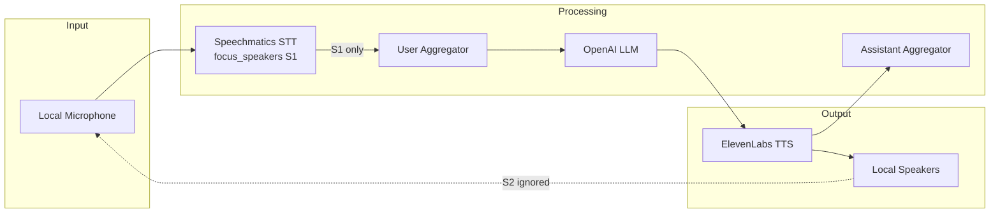

<div align="center">

<picture>
  <source media="(prefers-color-scheme: dark)" srcset="../logo/pipecat.png">
  <source media="(prefers-color-scheme: light)" srcset="../logo/pipecat.png">
  
</picture>

# Simple Voice Bot - Pipecat + Speechmatics

**Build a conversational voice bot using Pipecat AI with Speechmatics speech recognition.**

</div>

A complete voice assistant pipeline combining best-in-class speech recognition (Speechmatics), natural language processing (OpenAI), and text-to-speech (ElevenLabs) using the Pipecat AI framework - all running locally with your microphone and speakers.

## What You'll Learn

- How to integrate Speechmatics STT with Pipecat AI
- Building a complete voice assistant pipeline
- Using local audio transport (no cloud infrastructure needed)
- Voice Activity Detection (VAD) for natural conversations
- Filtering background audio and bot echo using speaker diarization

## Prerequisites

- **Speechmatics API Key**: Get one from [portal.speechmatics.com](https://portal.speechmatics.com/)
- **OpenAI API Key**: Get one from [platform.openai.com](https://platform.openai.com/)
- **ElevenLabs API Key**: Get one from [elevenlabs.io](https://elevenlabs.io/)
- **Python 3.10+** (Python 3.12 recommended)
- **PortAudio**: Required for local audio (see installation below)

## Quick Start

> [!TIP]
> **Using a remote VM or Windows?** This example uses `LocalAudioTransport` which requires local microphone access. For browser-based testing, see [02-simple-voice-bot-web](../02-simple-voice-bot-web/) instead.

### Python

**Step 1: Install PortAudio (system dependency)**

**On Windows:**
```bash
# PortAudio is included with PyAudio wheel - no separate install needed
```

**On Mac:**
```bash
brew install portaudio
```

**On Linux (Ubuntu/Debian):**
```bash
sudo apt-get install portaudio19-dev
```

**Step 2: Create and activate a virtual environment**

> [!IMPORTANT]
> **macOS Users**: Pipecat requires Python 3.10+. Your system Python may be older (e.g., Python 3.9.6). You must use Python 3.10+ when creating the virtual environment.

**On Windows:**
```bash
cd python
python -m venv venv
venv\Scripts\activate
```

**On Mac/Linux:**
```bash
cd python

# First, check your Python version
python3 --version

# If Python is below 3.10, install Python 3.12 via Homebrew (macOS)
brew install python@3.12

# Create venv with Python 3.12 explicitly
python3.12 -m venv venv
source venv/bin/activate

# Verify the venv is using the correct Python
python --version  # Should show Python 3.12.x
```

**Step 3: Install dependencies**

```bash
pip install --upgrade pip
pip install -r requirements.txt
```

> [!NOTE]
> **Dependency Conflicts**: If you see numpy/numba conflicts like `numba requires numpy<2.3`, fix with:
> ```bash
> pip install "numpy>=1.24,<2.3"
> ```

**Step 4: Configure your API keys**

```bash
cp ../.env.example .env
```

Open the `.env` file and add your API keys:

```
SPEECHMATICS_API_KEY=your_speechmatics_api_key_here
OPENAI_API_KEY=your_openai_api_key_here
ELEVENLABS_API_KEY=your_elevenlabs_api_key_here
```

> [!IMPORTANT]
> **Why `.env`?** Never commit API keys to version control. The `.env` file keeps secrets out of your code.

> [!NOTE]
> **Missing `.env.example` after download?** If you downloaded the repo as a ZIP file, dotfiles (files starting with `.`) may not appear in Finder or may be excluded. Use `git clone` instead, or run `ls -la ..` in terminal to verify the file exists. See [Troubleshooting](#dotfiles-missing-after-zip-download) for more details.

**Step 5: Run the example**

```bash
python main.py
```

## Architecture



## How It Works

### Pipeline Components

1. **Local Microphone** - Captures audio from your microphone via PyAudio
2. **Speechmatics STT** - Transcribes speech to text in real-time
3. **User Aggregator** - Builds conversation context for the LLM
4. **OpenAI LLM** - Generates intelligent responses
5. **ElevenLabs TTS** - Converts text responses to natural speech
6. **Local Speakers** - Plays audio back through your speakers
7. **Assistant Aggregator** - Tracks assistant responses for context

### Key Features

| Feature | Description |
|---------|-------------|
| **Local Audio** | Uses your microphone and speakers directly - no WebRTC needed |
| **VAD** | Silero Voice Activity Detection for natural turn-taking |
| **Speaker Focus** | Uses `focus_speakers=["S1"]` to ignore bot's own TTS output |
| **Diarization** | Speaker identification distinguishes user from bot |
| **Passive Filtering** | Background audio (TV, radio) marked as passive and ignored by LLM |
| **Interruptions** | User can interrupt the bot mid-response |

### Code Highlights

```python
# Local audio transport with VAD
transport = LocalAudioTransport(
    LocalAudioTransportParams(
        audio_in_enabled=True,
        audio_out_enabled=True,
        vad_analyzer=SileroVADAnalyzer(
            params=VADParams(min_volume=0.6)
        ),
    )
)

# Speechmatics STT with speaker focus and formatting
stt = SpeechmaticsSTTService(
    api_key=os.getenv("SPEECHMATICS_API_KEY"),
    params=SpeechmaticsSTTService.InputParams(
        enable_diarization=True,
        # Focus only on S1 (first speaker = user)
        # This ignores the bot's TTS output (labeled as S2)
        focus_speakers=["S1"],
        end_of_utterance_silence_trigger=0.5,
        speaker_active_format="<{speaker_id}>{text}</{speaker_id}>",
        speaker_passive_format="<PASSIVE><{speaker_id}>{text}</{speaker_id}></PASSIVE>",
    ),
)

# Pipeline: mic -> STT -> LLM -> TTS -> speakers
pipeline = Pipeline([
    transport.input(),
    stt,
    user_aggregator,
    llm,
    tts,
    transport.output(),
    assistant_aggregator,
])
```

> [!IMPORTANT]
> **Speak first!** The user must speak first to be registered as S1. The bot's TTS output will then be labeled as S2 and ignored by `focus_speakers=["S1"]`.

## Expected Output

```
INFO     | Starting voice bot...
INFO     | Speak first to register as the primary speaker (S1).
INFO     | Press Ctrl+C to exit.

You: "Hello there!"
Roxie: "Hey there! Roxie here, ready to make you laugh. What's on your mind?"

You: "Tell me a joke"
Roxie: "So I told my wife she was drawing her eyebrows too high... She looked surprised!"

You: "That's terrible"
Roxie: "Um... yeah, I know. But you still laughed a little, didn't you?"

^C
INFO     | Voice bot stopped.
```

## Customization

### Change the Voice

Edit the `voice_id` in `main.py`:

```python
tts = ElevenLabsTTSService(
    aiohttp_session=session,
    api_key=os.getenv("ELEVENLABS_API_KEY"),
    voice_id="your_voice_id_here",  # Find voices at elevenlabs.io
)
```

### Customize the Agent Prompt

Edit `assets/agent.md` to change the bot's personality and capabilities. The default prompt configures Roxie as a standup comedian with:

- Witty banter and snappy responses
- Natural hesitations (um, uh) for realistic speech
- Multi-speaker awareness (active listener in group conversations)
- Spoken format optimizations (no emojis, numbers as words, expanded acronyms)

### Speaker Diarization & Background Filtering

The STT is configured to identify speakers and filter background audio:

```python
stt = SpeechmaticsSTTService(
    api_key=os.getenv("SPEECHMATICS_API_KEY"),
    params=SpeechmaticsSTTService.InputParams(
        enable_diarization=True,
        speaker_active_format="<{speaker_id}>{text}</{speaker_id}>",
        speaker_passive_format="<PASSIVE><{speaker_id}>{text}</{speaker_id}></PASSIVE>",
        focus_speakers=["S1"],
    ),
)
```

| Parameter | Purpose |
|-----------|---------|
| `enable_diarization` | Identify different speakers in the audio |
| `speaker_active_format` | Format for the focused speaker: `<S1>Hello</S1>` |
| `speaker_passive_format` | Format for background audio: `<PASSIVE><S2>...</S2></PASSIVE>` |
| `focus_speakers` | Only treat S1 (first speaker) as active; others are passive |

**How it works:**
1. The user speaks first and is assigned `S1` (the primary user)
2. The bot's TTS output is labeled as S2 and filtered out
3. Other speakers (TV, radio, people nearby) are marked as passive
4. The agent prompt (`assets/agent.md`) instructs the LLM to ignore `<PASSIVE>` content
5. In multi-speaker scenarios, Roxie acts as an active listener and only joins when invited

This prevents the bot from hearing its own voice and responding to background audio.

### Adjust VAD Sensitivity

```python
vad_analyzer=SileroVADAnalyzer(
    params=VADParams(min_volume=0.6)  # Lower = more sensitive
)
```

## Browser-Based Alternative

If you're on a remote VM, Windows, or prefer browser-based testing, see **[02-simple-voice-bot-web](../02-simple-voice-bot-web/)** - a WebRTC version that works from any browser.

## Troubleshooting

### macOS-Specific Issues

#### Wrong Python Version in Virtual Environment

**Symptom:** `pip install` shows errors like:
```
ERROR: Ignored the following versions that require a different python version: 0.0.37 Requires-Python >=3.10 ...
ERROR: No matching distribution found for pipecat-ai
```

**Cause:** Your virtual environment was created with Python 3.9 (macOS system Python), but Pipecat requires Python 3.10+.

**Fix:**
```bash
# Check your current Python version
python3 --version

# If below 3.10, install Python 3.12 via Homebrew
brew install python@3.12

# Recreate the virtual environment with Python 3.12
deactivate
rm -rf venv
python3.12 -m venv venv
source venv/bin/activate
pip install --upgrade pip
pip install -r requirements.txt
```

#### NLTK SSL Certificate Error

**Symptom:**
```
[nltk_data] Error loading punkt_tab: <urlopen error [SSL:
[nltk_data]     CERTIFICATE_VERIFY_FAILED] certificate verify failed
```

**Fix:**
```bash
# Install certifi and download NLTK data with SSL workaround
pip install certifi
python3 -c "import ssl; ssl._create_default_https_context = ssl._create_unverified_context; import nltk; nltk.download('punkt_tab')"
```

#### Dotfiles Missing After ZIP Download

**Symptom:** `.env.example` is missing after downloading the repo as a ZIP from GitHub.

**Cause:** macOS Finder hides dotfiles by default, and some ZIP extraction methods may exclude them.

**Fix options:**

1. **Check if it's just hidden:**
   ```bash
   ls -la ..  # List all files including hidden ones
   ```

2. **Use `git clone` instead of ZIP download:**
   ```bash
   git clone https://github.com/speechmatics/speechmatics-academy.git
   ```

3. **Show hidden files in Finder:**
   ```bash
   defaults write com.apple.finder AppleShowAllFiles YES
   killall Finder
   ```

4. **Create the file manually** if truly missing:
   ```bash
   cat > .env << 'EOF'
   SPEECHMATICS_API_KEY=your_speechmatics_api_key_here
   OPENAI_API_KEY=your_openai_api_key_here
   ELEVENLABS_API_KEY=your_elevenlabs_api_key_here
   EOF
   ```

### General Issues

**Error: "No module named 'pyaudio'"**
- Install PortAudio first (see Step 1)
- On Windows, try: `pip install pipwin && pipwin install pyaudio`

**Error: "Invalid API key"**
- Verify all API keys in your `.env` file
- Check each service's portal for key validity

**Error: numpy/numba dependency conflict**

**Symptom:**
```
numba 0.61.2 requires numpy<2.3,>=1.24, but you have numpy 2.3.5 which is incompatible.
```

**Fix:**
```bash
pip install "numpy>=1.24,<2.3"
```

**No audio input detected**
- Check your microphone is selected as default input device
- Try lowering `min_volume` in VADParams

**Bot doesn't respond**
- Check OpenAI API key is valid
- Verify you have API credits available

**Audio output issues**
- Check your speakers are selected as default output device
- Verify ElevenLabs API key and voice_id are correct

## Next Steps

- **[Simple Voice Bot (Web)](../02-simple-voice-bot-web/)** - Browser-based version with WebRTC
- **[Voice Agent Turn Detection](../../../basics/08-voice-agent-turn-detection/)** - Learn about turn detection presets
- **[Voice Agent Speaker ID](../../../basics/09-voice-agent-speaker-id/)** - Advanced speaker identification

## Resources

- [Pipecat AI Documentation](https://docs.pipecat.ai/)
- [Speechmatics Pipecat Integration](https://docs.pipecat.ai/server/services/stt/speechmatics)
- [Speechmatics API Docs](https://docs.speechmatics.com/)
- [ElevenLabs API Docs](https://elevenlabs.io/docs)
- [OpenAI API Docs](https://platform.openai.com/docs)

---

## Feedback

Help us improve this guide:
- Found an issue? [Report it](https://github.com/speechmatics/speechmatics-academy/issues)
- Have suggestions? [Open a discussion](https://github.com/orgs/speechmatics/discussions/categories/academy)

---

**Time to Complete**: 10 minutes
**Difficulty**: Intermediate
**Integration**: Pipecat AI

[Back to Integrations](../../) | [Back to Academy](../../../README.md)