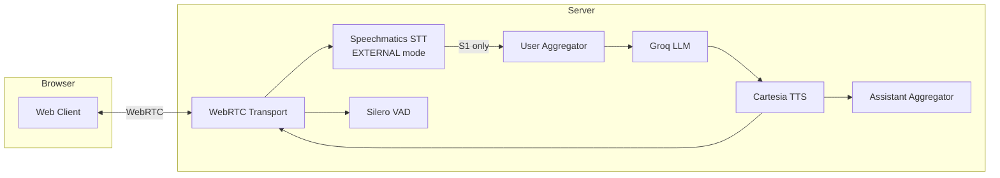

<div align="center">

<picture>
  <source media="(prefers-color-scheme: dark)" srcset="../logo/pipecat.png">
  <source media="(prefers-color-scheme: light)" srcset="../logo/pipecat.png">
  
</picture>

# Simple Voice Bot (Web) - Pipecat + Speechmatics

**Build a browser-based conversational voice bot using Pipecat AI with Speechmatics speech recognition.**

</div>

A complete voice assistant pipeline combining best-in-class speech recognition (Speechmatics), natural language processing (Groq), and text-to-speech (Cartesia) using the Pipecat AI framework - accessible via any web browser using WebRTC.

This example is optimized for low latency:

- Speechmatics STT uses `EXTERNAL` turn detection mode (default) to minimize end-of-utterance delay
- Groq is used for fast LLM responses
- Cartesia is used for fast streaming TTS

> [!TIP]
> **Looking for local microphone version?** See [01-simple-voice-bot](../01-simple-voice-bot/) for a version that uses your local microphone and speakers directly.

## What You'll Learn

- How to integrate Speechmatics STT with Pipecat AI
- Building a browser-based voice assistant with WebRTC
- Using the Pipecat runner framework for web deployment
- Turn detection modes for natural conversations
- Filtering background audio and bot echo using speaker diarization
- Running a low-latency WebRTC pipeline with the Pipecat runner
- Measuring latency per component (STT / LLM / TTS) in the browser

## Prerequisites

- **Speechmatics API Key**: Get one from [portal.speechmatics.com](https://portal.speechmatics.com/)
- **Groq API Key**: Get one from [console.groq.com](https://console.groq.com/)
- **Cartesia API Key**: Get one from [cartesia.ai](https://cartesia.ai/)
- **Python 3.12+** (Python 3.12-3.13 supported)
- **macOS, Linux, or WSL2** (Windows native not supported for WebRTC)

## Quick Start

> [!NOTE]
> WebRTC transport requires macOS or Linux. **Windows users**: Use WSL2 (see [Windows WSL2 Setup](#windows-wsl2-setup) below).

### macOS/Linux

**Step 1: Create and activate a virtual environment**

```bash
cd python
python3 -m venv .venv
source .venv/bin/activate
```

**Step 2: Install dependencies**

```bash
pip install --upgrade pip
pip install -r requirements.txt
```

**Step 3: Configure your API keys**

```bash
cp ../.env.example .env
```

Open the `.env` file and add your API keys:

```
SPEECHMATICS_API_KEY=your_speechmatics_api_key_here
GROQ_API_KEY=your_groq_api_key_here
CARTESIA_API_KEY=your_cartesia_api_key_here
SPEECHMATICS_RT_URL=wss://eu2.rt.speechmatics.com/v2
```

`SPEECHMATICS_RT_URL` controls which Speechmatics realtime endpoint is used. The default is the EU endpoint; set it to the US endpoint as needed

```
SPEECHMATICS_RT_URL=wss://us.rt.speechmatics.com/v2

Having the closest endpoint will reduce latency.
```

**Step 4: Run the bot**

```bash
uv run python main.py
```

**Step 5: Connect via browser**

Open [http://localhost:7860/client](http://localhost:7860/client) and click **Connect**.

To inspect performance, open the **Metrics** tab in the UI to see per-component timings (e.g. STT and LLM TTFB, TTS processing/TTFB).

### Windows WSL2 Setup

WebRTC dependencies don't work on Windows native. Use WSL2:

**Step 1: Install WSL2 (if not already)**

```powershell
wsl --install
```

**Step 2: Set up in WSL2**

<details>
<summary><strong>Option A: Using uv (Recommended)</strong></summary>

```bash
# Copy example to WSL native filesystem (avoids path issues)
# Replace YOUR_PATH with your actual Windows path to speechmatics-academy
mkdir -p ~/projects
cp -r /mnt/c/YOUR_PATH/integrations/pipecat/02-simple-voice-bot-web ~/projects/
cd ~/projects/02-simple-voice-bot-web

# Install uv if not already installed
curl -LsSf https://astral.sh/uv/install.sh | sh

# Sync dependencies (uses pyproject.toml)
uv sync

# Copy and configure your .env file
cp /mnt/c/YOUR_PATH/02-simple-voice-bot-web/.env.example .env
nano .env  # Add your API keys, then Ctrl+O to save, Ctrl+X to exit

# Run
uv run python python/main.py
```

</details>

<details>
<summary><strong>Option B: Using pip</strong></summary>

```bash
# Copy example to WSL native filesystem (avoids path issues)
# Replace YOUR_PATH with your actual Windows path to speechmatics-academy
mkdir -p ~/projects
cp -r /mnt/c/YOUR_PATH/integrations/pipecat/02-simple-voice-bot-web ~/projects/
cd ~/projects/02-simple-voice-bot-web/python

# Create venv and install deps
python3 -m venv .venv
source .venv/bin/activate
pip install --upgrade pip
pip install -r requirements.txt

# Copy and configure your .env file
cp /mnt/c/YOUR_PATH/02-simple-voice-bot-web/.env.example ../.env
nano ../.env  # Add your API keys, then Ctrl+O to save, Ctrl+X to exit

# Run
python main.py
```

</details>

**Step 3: Connect via browser**

Open [http://localhost:7860/client](http://localhost:7860/client) in your Windows browser and click **Connect**.

## Architecture



## How It Works

### Pipeline Components

1. **WebRTC Transport** - Handles browser audio via WebRTC peer connection
2. **Speechmatics STT** - Transcribes speech to text in real-time with diarization and turn detection
3. **User Aggregator** - Builds conversation context for the LLM
4. **Groq LLM** - Generates intelligent responses
5. **Cartesia TTS** - Converts text responses to natural speech
6. **Assistant Aggregator** - Tracks assistant responses for context

### Key Features

| Feature | Description |
|---------|-------------|
| **Browser-Based** | Works from any browser - no local audio setup needed |
| **WebRTC** | Low-latency peer-to-peer audio streaming |
| **EXTERNAL Turn Detection** | Pipecat handles turn detection using external VAD (e.g., Silero) |
| **Speaker Focus** | Uses `focus_speakers=["S1"]` to ignore background audio |
| **Diarization** | Speaker identification distinguishes user from others |
| **Passive Filtering** | Background audio (TV, radio) marked as passive and ignored by LLM |
| **Auto Greeting** | Bot greets user when connection is established |

### Code Highlights

```python
# Speechmatics STT with EXTERNAL turn detection and diarization
stt = SpeechmaticsSTTService(
    api_key=os.getenv("SPEECHMATICS_API_KEY"),
    params=SpeechmaticsSTTService.InputParams(
        enable_speaker_diarization=True,
        focus_speakers=["S1"],
        turn_detection_mode=SpeechmaticsSTTService.TurnDetectionMode.EXTERNAL,
        speaker_active_format="<{speaker_id}>{text}</{speaker_id}>",
        speaker_passive_format="<PASSIVE><{speaker_id}>{text}</{speaker_id}></PASSIVE>",
    ),
)

# WebRTC transport with external VAD
transport_params = {
    "webrtc": lambda: TransportParams(
        audio_in_enabled=True,
        audio_out_enabled=True,
        vad_analyzer=SileroVADAnalyzer(params=VADParams(stop_secs=0.2)),
    ),
}

# Pipeline: browser -> STT -> LLM -> TTS -> browser
pipeline = Pipeline([
    transport.input(),
    stt,
    context_aggregator.user(),
    llm,
    tts,
    transport.output(),
    context_aggregator.assistant(),
])
```

## Expected Output

```
INFO     | Loading pipeline components...
INFO     | All components loaded!
INFO     | Started server process
INFO     | Uvicorn running on http://0.0.0.0:7860

# After clicking Connect in browser:
INFO     | Client connected
INFO     | Starting bot

Roxie: "Hey there! Roxie here, ready to make you laugh. What's on your mind?"

You: "Tell me a joke"
Roxie: "So I told my wife she was drawing her eyebrows too high... She looked surprised!"
```

## Measuring Latency

After connecting in the browser, open the **Metrics** tab in the web UI.

Use it to inspect per-component timings and validate latency improvements:

- **Speech-to-Text (Speechmatics)**
- **LLM (Groq)**
- **Text-to-Speech (Cartesia)**

## Customization

### Change the Voice

Edit the `voice_id` in `main.py`:

```python
tts = CartesiaTTSService(
    api_key=os.getenv("CARTESIA_API_KEY"),
    voice_id="your_voice_id_here",
)
```

### Customize the Agent Prompt

Edit `assets/agent.md` to change the bot's personality and capabilities. The default prompt configures Roxie as a standup comedian with:

- Witty banter and snappy responses
- Natural hesitations (um, uh) for realistic speech
- Multi-speaker awareness (active listener in group conversations)
- Spoken format optimizations (no emojis, numbers as words, expanded acronyms)

### Turn Detection Modes

Speechmatics provides three turn detection modes that control how the system determines when a user has finished speaking:

| Mode | Description | External VAD |
|------|-------------|--------------|
| `EXTERNAL` | Default. Relies on Pipecat's VAD (e.g., Silero) for turn detection | Required |
| `ADAPTIVE` | Speechmatics handles turn detection using silence-based detection | Must be disabled |
| `SMART_TURN` | Speechmatics uses ML-based smart turn detection | Must be disabled |

> [!IMPORTANT]
> **VAD Compatibility:** When using `ADAPTIVE` or `SMART_TURN` mode, you must disable Pipecat's external VAD (e.g., Silero). If both are enabled, you'll see warnings in the logs when an external VAD call is received. This example uses `EXTERNAL` mode with external VAD.

```python
# EXTERNAL mode - Pipecat handles turn detection using external VAD
stt = SpeechmaticsSTTService(
    api_key=os.getenv("SPEECHMATICS_API_KEY"),
    params=SpeechmaticsSTTService.InputParams(
        turn_detection_mode=SpeechmaticsSTTService.TurnDetectionMode.EXTERNAL,
    ),
)

# External VAD in transport params when using EXTERNAL mode
transport_params = {
    "webrtc": lambda: TransportParams(
        audio_in_enabled=True,
        audio_out_enabled=True,
        vad_analyzer=SileroVADAnalyzer(params=VADParams(stop_secs=0.2)),
    ),
}
```

### Speaker Diarization & Background Filtering

The STT is configured to identify speakers and filter background audio:

```python
stt = SpeechmaticsSTTService(
    api_key=os.getenv("SPEECHMATICS_API_KEY"),
    params=SpeechmaticsSTTService.InputParams(
        enable_speaker_diarization=True,
        speaker_active_format="<{speaker_id}>{text}</{speaker_id}>",
        speaker_passive_format="<PASSIVE><{speaker_id}>{text}</{speaker_id}></PASSIVE>",
        focus_speakers=["S1"],
    ),
)
```

| Parameter | Purpose |
|-----------|---------|
| `enable_speaker_diarization` | Identify different speakers in the audio |
| `speaker_active_format` | Format for the focused speaker: `<S1>Hello</S1>` |
| `speaker_passive_format` | Format for background audio: `<PASSIVE><S2>...</S2></PASSIVE>` |
| `focus_speakers` | Only treat S1 (first speaker) as active; others are passive |

## Troubleshooting

**Nothing happens after clicking Connect**
- Wait a few seconds for services to initialize
- Check the terminal for any error messages about API keys
- Try refreshing the browser and connecting again

**Error: "No module named 'pipecat_ai_small_webrtc_prebuilt'"**
```bash
pip install pipecat-ai-small-webrtc-prebuilt
```

**Error: "Invalid API key"**
- Verify all API keys in your `.env` file
- Check each service's portal for key validity

**No audio in browser**
- Check browser microphone permissions
- Ensure no other application is using the microphone

### WSL2-Specific Issues

**Error: "ensurepip is not available"**

Install the Python venv package:
```bash
sudo apt update && sudo apt install python3.12-venv -y
```

**Forgot WSL sudo password**

Open PowerShell (not WSL) and run:
```powershell
wsl -u root
passwd your_username
exit
```

**Error: "bad marshal data" or "marshal data too short"**

Python bytecode corruption. Clear cache and recreate venv:
```bash
deactivate
rm -rf .venv ~/.cache/pip
python3 -m venv .venv
source .venv/bin/activate
pip install --upgrade pip
pip install -r requirements.txt
```

**.env file is read-only / write-protected**

Files copied from Windows are read-only. Create a new one:
```bash
rm .env
cat > .env << 'EOF'
SPEECHMATICS_API_KEY=your_key_here
GROQ_API_KEY=your_key_here
CARTESIA_API_KEY=your_key_here
EOF
```

**General WSL2 tip**: Always work in native WSL filesystem (`~/`) not Windows mounts (`/mnt/c/`)

## Next Steps

- **[Simple Voice Bot (Local)](../01-simple-voice-bot/)** - Local microphone version
- **[Voice Agent Turn Detection](../../../basics/08-voice-agent-turn-detection/)** - Learn about turn detection presets
- **[Voice Agent Speaker ID](../../../basics/09-voice-agent-speaker-id/)** - Advanced speaker identification

## Resources

- [Pipecat AI Documentation](https://docs.pipecat.ai/)
- [Pipecat SmallWebRTC Transport](https://docs.pipecat.ai/server/services/transport/small-webrtc)
- [Speechmatics Pipecat Integration](https://docs.pipecat.ai/server/services/stt/speechmatics)
- [Speechmatics API Docs](https://docs.speechmatics.com/)
- [Groq API Docs](https://console.groq.com/docs)
- [Cartesia API Docs](https://docs.cartesia.ai/)

---

## Feedback

Help us improve this guide:
- Found an issue? [Report it](https://github.com/speechmatics/speechmatics-academy/issues)
- Have suggestions? [Open a discussion](https://github.com/orgs/speechmatics/discussions/categories/academy)

---

**Time to Complete**: 10 minutes
**Difficulty**: Intermediate
**Integration**: Pipecat AI (WebRTC)

[Back to Integrations](../../) | [Back to Academy](../../../README.md)
