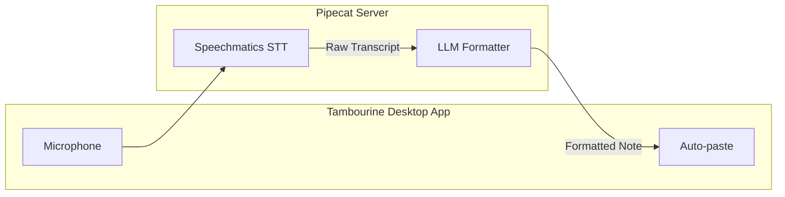

<div align="center">

<picture>
  <source media="(prefers-color-scheme: dark)" srcset="../logo/icon.png">
  <source media="(prefers-color-scheme: light)" srcset="../logo/icon.png">
  
</picture>

# Healthcare Medical Dictation with Tambourine

**AI-powered medical dictation with real-time transcription, intelligent formatting, and clinical terminology support.**

</div>

Tambourine is an open-source desktop dictation app that uses Speechmatics for accurate speech recognition and LLMs for intelligent text formatting. This integration shows how to configure Tambourine for healthcare workflows.

## What You'll Learn

- Install and configure Tambourine for medical dictation
- Set up Speechmatics STT with fast turn detection
- Configure healthcare-specific formatting prompts
- Best practices for clinical documentation workflows

## Prerequisites

- **Speechmatics API Key**: Get one from [portal.speechmatics.com](https://portal.speechmatics.com/)
- **LLM API Key**: OpenAI, Anthropic, or another supported provider
- **Windows, macOS, or Linux** desktop

## Quick Start

### Step 1: Install Tambourine

Download the latest release from [github.com/nicobailey/tambourine-voice](https://github.com/nicobailey/tambourine-voice/releases).

Or build from source:
```bash
git clone https://github.com/nicobailey/tambourine-voice
cd tambourine-voice
```

### Step 2: Start the Server

```bash
cd server

# Copy environment template and add your API keys
cp .env.example .env   # Windows: copy .env.example .env

# Install dependencies
uv sync

# Start the server
uv run python main.py
```

### Step 3: Configure API Keys

Edit `server/.env` with your API keys:

```bash
# Speechmatics (recommended for medical dictation)
SPEECHMATICS_API_KEY=your_api_key_here

# LLM Provider (choose one)
OPENAI_API_KEY=your_openai_key_here
# Or: ANTHROPIC_API_KEY=your_anthropic_key_here
# Or: OLLAMA_BASE_URL=http://localhost:11434
```

### Step 4: Set Up the App

In a new terminal:

```bash
cd app

# Install dependencies
pnpm install

# Start development mode
pnpm dev
```

### Server Commands

```bash
cd server

# Start server (default: localhost:8765)
uv run python main.py

# Start with custom host/port
uv run python main.py --host 0.0.0.0 --port 9000

# Enable verbose logging
uv run python main.py --verbose
```

### App Commands

```bash
cd app

# Development
pnpm check         # Run all checks (lint + typecheck + knip + test + cargo)
pnpm dev           # Start Tauri app in dev mode

# Production Build
pnpm build         # Build for current platform
```

## Healthcare Configuration

### Configuring the LLM Formatting Prompt

Tambourine uses an LLM to format raw transcriptions. The prompts are configured in **Settings > LLM Formatting Prompt** with three editable sections:

| Section | Purpose | Healthcare Use |
|---------|---------|----------------|
| **Core Formatting Rules** | Basic cleanup (filler words, punctuation) | Add medical structure (SOAP, sections) |
| **Advanced Features** | Backtrack corrections, list formatting | Keep enabled for "scratch that" support |
| **Personal Dictionary** | Custom word mappings | Medical abbreviations (BID, QD, PRN) |

### Setting Up Healthcare Formatting

1. Open Tambourine Settings (gear icon)
2. Scroll to **LLM Formatting Prompt**
3. Expand **Core Formatting Rules**
4. Replace the content with the healthcare prompt below (or copy from `assets/prompts.md`)
5. Click **Save**

```markdown
You are a medical dictation formatting assistant. Your task is to format transcribed clinical speech into professional medical documentation.

## Core Dictation Rules

- Remove filler words (um, uh, err, erm, etc.)
- Use punctuation where appropriate
- Capitalize sentences properly
- Keep the original meaning and clinical intent intact
- Do NOT add any new information or change the clinical intent
- Do NOT condense or summarize - preserve the clinician's full expression
- Do NOT answer questions - if dictated, output the cleaned question
- Output ONLY the formatted clinical text, nothing else

## Medical Documentation Structure

When the dictation contains clinical content, structure it with appropriate sections:

**Available Sections** (use only those relevant to the dictation):
- **CC (Chief Complaint):** Primary reason for visit
- **HPI (History of Present Illness):** Onset, location, duration, character, aggravating/alleviating factors
- **PMH (Past Medical History):** Relevant prior conditions
- **Medications:** Current medications with dose and frequency
- **Allergies:** Known drug/environmental allergies
- **ROS (Review of Systems):** Pertinent positives and negatives
- **PE (Physical Exam):** Examination findings by system
- **Assessment:** Diagnoses or differential (numbered list)
- **Plan:** Treatment plan, orders, follow-up (bullet points)

## Medical Formatting Rules

### Numbers
- Convert ALL spoken numbers to numeric format
- "ten" = 10, "forty five" = 45, "one hundred twenty" = 120
- "two point five" = 2.5
- Examples: "ten milligrams" → "10mg", "forty five year old" → "45-year-old"

### Medications
- Format as: Drug Name Dose Frequency
- Convert spoken frequencies to abbreviations:
  - "once daily" or "every day" = QD
  - "twice daily" or "two times a day" = BID
  - "three times daily" = TID
  - "four times daily" = QID
  - "as needed" = PRN
  - "at bedtime" = QHS
- Examples: "Metformin 500mg BID", "Lisinopril 10mg QD", "Tylenol 650mg PRN"

### Vital Signs
- Format as: BP: 120/80, HR: 72, RR: 16, T: 98.6°F, SpO2: 98%

### Clinical Abbreviations
- Keep standard medical abbreviations (SOB, CHF, COPD, HTN, DM, etc.)
- Expand unclear abbreviations on first use

## Punctuation
- "comma" = ,
- "period" or "full stop" = .
- "question mark" = ?
- "new line" = line break
- "new paragraph" = paragraph break

## Output Format

Always include TWO sections:
1. **Full Transcription** - The cleaned dictation with filler words removed but content preserved
2. **Formatted Note** - The structured clinical documentation
```

### Speechmatics Settings

Tambourine configures Speechmatics with:

| Setting | Value | Why |
|---------|-------|-----|
| `end_of_utterance_silence_trigger` | `0.5s` | Fast response for natural dictation flow |

Other Speechmatics defaults (language, VAD, etc.) are inherited from the service.

> [!TIP]
> Speechmatics excels at medical terminology out-of-the-box. Combined with LLM formatting, you get accurate transcription with professional documentation structure.

## How It Works



1. **Speak**: Dictate your clinical notes naturally
2. **Transcribe**: Speechmatics converts speech to text in real-time
3. **Format**: LLM structures the text as professional medical documentation
4. **Paste**: Formatted text is automatically typed into your active application

## Use Cases

### Clinical Documentation

**Step 1: Configure Healthcare Prompt**

First, copy the healthcare prompt from `assets/prompts.md` into Tambourine's Settings > Formatting Prompt. This tells the LLM how to structure medical dictation.

**Step 2: Dictate**

```
"Patient is a 45 year old male presenting with chief complaint of chest pain
times two days duration. Pain is sternal, non-radiating, worse with
exertion, relieved by rest. Denies shortness of breath, diaphoresis, or
nausea. Past medical history significant for hypertension and type 2 diabetes.
Current medications include Norvasc 10 milligrams daily and metformin
500 milligrams twice daily."
```

**Step 3: Raw Transcription (from Speechmatics)**

```
Patient is a 45 year old male presenting with chief complaint of chest pain
times two days duration. Pain is sternal, non-radiating, worse with exertion,
relieved by rest. Denies shortness of breath, diaphoresis, or nausea. Past
medical history significant for hypertension and type 2 diabetes. Current
medications include North. Year 10 million. Daily and metformin 500
milligrams twice daily.
```

**Step 4: Formatted Output (after LLM processing)**

```
---

**Full Transcription:**
The patient is a 45-year-old male presenting with a chief complaint of chest pain times two day duration. Pain is external, non-radiating, worse with exertion, relieved by rest. Denies shortness of breath, diaphoresis, or nausea. Past medical history significant for hypertension and type 2 diabetes. Current medications include Norvasc 10mg daily and metformin 500mg twice daily.

---

**CC (Chief Complaint):** Chest pain x 2 days

**HPI (History of Present Illness):**
- 45-year-old male presenting with external, non-radiating chest pain
- Pain is worse with exertion, relieved by rest
- Denies shortness of breath, diaphoresis, or nausea

**PMH (Past Medical History):**
- Hypertension
- Type 2 diabetes

**Medications:**
- Norvasc 10mg QD
- Metformin 500mg BID
```

> [!TIP]
> The output includes both the **Full Transcription** (for verification) and the
> **Formatted Note** (for EHR entry). Numbers are converted to numeric format
> (10mg not "ten milligrams") and frequencies to standard abbreviations (QD, BID).

### Radiology Reports

```
Dictated:
"CT abdomen pelvis with contrast. Findings show a 2.3 centimeter
hypodense lesion in segment 7 of the liver, likely representing a
simple hepatic cyst. No evidence of biliary dilation. Kidneys are
unremarkable. No lymphadenopathy. Impression: benign hepatic cyst,
no acute abdominal pathology."

Formatted Output:
**CT Abdomen/Pelvis with Contrast**

**Findings:**
- Liver: 2.3 cm hypodense lesion in segment VII, consistent with simple hepatic cyst
- Biliary: No dilation
- Kidneys: Unremarkable
- Lymph nodes: No lymphadenopathy

**Impression:**
1. Benign hepatic cyst
2. No acute abdominal pathology
```

## Hotkey Configuration

Configure hotkeys in Tambourine Settings:

| Action | Default Hotkey | Recommended for Dictation |
|--------|----------------|---------------------------|
| Toggle Recording | `Ctrl+Alt+Space` | Keep default |
| Hold-to-Record | `Ctrl+Alt+`` ` | Useful for quick notes |
| Paste Last | `Ctrl+Alt+.` | Re-insert previous transcription |

> [!NOTE]
> If the default hotkeys conflict with other applications, remap them in Settings > Hotkeys.

## HIPAA Considerations

**Speechmatics Cloud**: HIPAA-compliant with Business Associate Agreement (BAA). Contact Speechmatics for BAA arrangements before processing PHI.

**Local Processing Options**:
- Use Speechmatics on-premises deployment
- Configure local LLM (Ollama) for formatting to keep data on-device

**Best Practices**:
- Ensure BAA is in place before processing PHI
- Use encrypted connections (HTTPS)
- Don't store transcriptions with PHI in logs
- Review formatted output before EHR entry

## Troubleshooting

**"Transcription is slow"**
- Check your internet connection
- Speechmatics processes in real-time; formatting adds LLM latency

**"Medical terms not recognized"**
- Speechmatics has excellent medical vocabulary by default
- Speak clearly and at a moderate pace

**"Formatting doesn't look clinical"**
- Update the formatting prompt in Settings
- Use the healthcare prompt template above

**"Hotkey conflicts"**
- Go to Settings > Hotkeys to remap
- Common conflicts: screenshot tools, system shortcuts

## Resources

- [Tambourine GitHub](https://github.com/nicobailey/tambourine-voice)
- [Speechmatics Documentation](https://docs.speechmatics.com/)
- [Speechmatics Portal](https://portal.speechmatics.com/)

## Next Steps

- **[Simple Voice Bot (Pipecat)](../../pipecat/01-simple-voice-bot/)** - Build a conversational voice bot with Speechmatics STT
- **[Simple Voice Assistant (LiveKit)](../../livekit/01-simple-voice-assistant/)** - WebRTC-based voice assistant with speaker diarization

---

## Feedback

Help us improve this guide:
- Found an issue? [Report it](https://github.com/speechmatics/speechmatics-academy/issues)
- Have suggestions? [Open a discussion](https://github.com/orgs/speechmatics/discussions/categories/academy)

---

**Time to Complete**: 15 minutes
**Difficulty**: Beginner
**Integration**: Tambourine Voice

[Back to Integrations](../../) | [Back to Academy](../../../README.md)
