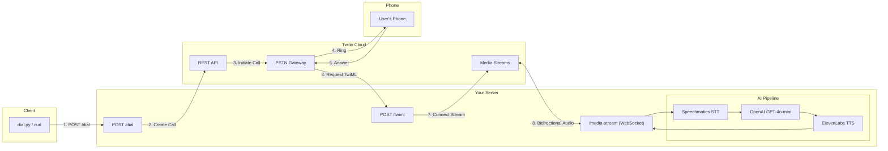

<div align="center">


# Outbound Dialer - Twilio + Speechmatics

**Make your AI voice assistant call any phone number using the Twilio REST API.**

</div>

This example shows how to programmatically initiate outbound calls. The assistant calls the user, making it perfect for appointment reminders, notifications, or proactive customer outreach.

## What You'll Learn

- How to use the **Twilio REST API** to initiate outbound calls
- Building a server that handles both API requests and Media Streams
- Creating a CLI tool to trigger calls
- Combining REST API with WebSocket audio streaming

## Prerequisites

- **Speechmatics API Key**: Get one from [portal.speechmatics.com](https://portal.speechmatics.com/)
- **OpenAI API Key**: Get one from [platform.openai.com](https://platform.openai.com/)
- **ElevenLabs API Key**: Get one from [elevenlabs.io](https://elevenlabs.io/)
- **Twilio Account**: Get one from [twilio.com](https://www.twilio.com/)
- **Twilio Phone Number**: Purchase a phone number in the Twilio Console
- **Python 3.10+**
- **ngrok** (for local development)

## Quick Start

### Step 1: Setup

```bash
cd python
python -m venv venv

# Windows
venv\Scripts\activate

# Mac/Linux
source venv/bin/activate

pip install -r requirements.txt
```

### Step 2: Configure Environment

```bash
cp ../.env.example .env
```

Edit `.env` with your credentials:

```env
SPEECHMATICS_API_KEY=your_key_here
OPENAI_API_KEY=your_key_here
ELEVENLABS_API_KEY=your_key_here
TWILIO_ACCOUNT_SID=ACxxxxxxxxxxxxx
TWILIO_AUTH_TOKEN=your_auth_token
TWILIO_PHONE_NUMBER=+14155551234
```

### Step 3: Start the Server

```bash
python main.py
```

### Step 4: Start ngrok

In a new terminal:

```bash
# Windows (if ngrok is in C:\ngrok)
C:\ngrok\ngrok.exe http 5000

# Or if ngrok is in PATH
ngrok http 5000
```

ngrok will display your public URL:

```
ngrok                                                           (Ctrl+C to quit)

Session Status                online
Account                       your-email@example.com (Plan: Free)
Version                       3.18.4
Region                        Europe (eu)
Web Interface                 http://127.0.0.1:4040
Forwarding                    https://abc123.ngrok-free.dev -> http://localhost:5000
                              ^^^^^^^^^^^^^^^^^^^^^^^^^^^^^^^^
                              This is your public URL - copy this!

Connections                   ttl     opn     rt1     rt5     p50     p90
                              0       0       0.00    0.00    0.00    0.00
```

Copy the HTTPS URL from the **Forwarding** line (e.g., `https://abc123.ngrok-free.dev`)

### Step 5: Make a Call

**Option A: Using the CLI tool**

```bash
python dial.py +14155559999 --server https://abc123.ngrok-free.dev
```

**Option B: Using curl**

```bash
curl -X POST https://abc123.ngrok-free.dev/dial \
  -H "Content-Type: application/json" \
  -d '{"to": "+14155559999"}'
```

**Option C: Using the Twilio REST API directly**

```bash
python dial.py +14155559999 --webhook https://abc123.ngrok-free.dev/twiml
```

Your phone will ring. Answer it to talk to the AI assistant!

## Architecture



## How It Works

### Call Flow

1. **Trigger**: You call `POST /dial` with a phone number
2. **API Call**: Server uses Twilio REST API to initiate outbound call
3. **Ring**: Twilio calls the specified phone number
4. **Answer**: When answered, Twilio requests `/twiml` webhook
5. **Connect**: TwiML response tells Twilio to open Media Stream
6. **Stream**: Bidirectional WebSocket audio flows through `/media-stream`
7. **Conversation**: Speechmatics STT → OpenAI → ElevenLabs TTS

### Key Difference from Inbound

| Aspect | Inbound (01-voice-assistant) | Outbound (02-outbound-dialer) |
|--------|------------------------------|-------------------------------|
| Initiation | User calls Twilio number | Server calls user via REST API |
| Trigger | Phone call to your number | POST request to `/dial` |
| Webhook Config | Required in Twilio Console | Not needed (URL in API call) |
| TTS Provider | Speechmatics | ElevenLabs (streaming) |
| Use Case | Call center, support line | Reminders, notifications, outreach |

## API Reference

### POST /dial

Initiate an outbound call.

**Request:**
```json
{
  "to": "+14155559999"
}
```

**Response:**
```json
{
  "success": true,
  "call_sid": "CAxxxxxxxxxx",
  "to": "+14155559999",
  "from": "+14155551234"
}
```

### GET /

Health check endpoint.

```json
{
  "status": "running",
  "service": "Outbound Dialer"
}
```

## CLI Tool Usage

The `dial.py` script provides two modes:

### Via Server (Recommended)

```bash
# Server handles Twilio API internally
python dial.py +14155559999 --server https://abc123.ngrok-free.dev
```

### Direct to Twilio

```bash
# Calls Twilio API directly (requires env vars)
python dial.py +14155559999 --webhook https://abc123.ngrok-free.dev/twiml
```

## Customization

### Change the Assistant Personality

Edit `assets/agent.md` to customize how the assistant speaks.

### Change the ElevenLabs Voice

In `main.py`, change the voice ID:

```python
# Find voice IDs at elevenlabs.io/voice-library
ELEVENLABS_VOICE_ID = "21m00Tcm4TlvDq8ikWAM"  # Rachel (default)
```

### Add Call Status Callbacks

Twilio can notify you of call status changes:

```python
call = twilio_client.calls.create(
    to=to_number,
    from_=TWILIO_PHONE_NUMBER,
    url=f"{WEBHOOK_BASE_URL}/twiml",
    status_callback=f"{WEBHOOK_BASE_URL}/call-status",
    status_callback_event=["initiated", "ringing", "answered", "completed"],
)
```

## Use Cases

- **Appointment Reminders**: Call patients/clients before their appointments
- **Delivery Notifications**: Call customers when delivery is arriving
- **Survey Collection**: Outbound calls to collect feedback
- **Emergency Alerts**: Mass notification system
- **Personal Assistant**: "Call me back in 5 minutes"

## Troubleshooting

**Call not going through**
- Verify phone number is in E.164 format (+14155559999)
- Check Twilio account has sufficient balance
- Ensure the "to" number can receive calls from your Twilio number

**"Invalid webhook URL" in Twilio logs**
- Make sure ngrok is running
- Verify the URL is HTTPS (not HTTP)

**No audio after answering**
- Check that the WebSocket endpoint is accessible
- Verify Speechmatics and ElevenLabs API keys are valid
- Look for errors in server logs

## Resources

- [Twilio REST API - Create Call](https://www.twilio.com/docs/voice/api/call-resource#create-a-call-resource)
- [Twilio Media Streams](https://www.twilio.com/docs/voice/media-streams)
- [Speechmatics Voice Agent](https://docs.speechmatics.com/voice-agent)
- [ElevenLabs API](https://elevenlabs.io/docs)

---

**Difficulty**: Intermediate
**Integration**: Twilio REST API + Media Streams
