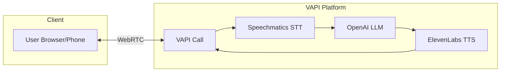

<div align="center">

<picture>
  <source media="(prefers-color-scheme: dark)" srcset="../logo/vapi-light.png">
  <source media="(prefers-color-scheme: light)" srcset="../logo/vapi-dark.png">
  
</picture>

# VAPI Voice Assistant with Speechmatics

**Build voice assistants using VAPI with Speechmatics as the transcription provider.**

</div>

## What You'll Learn

- Creating VAPI assistants with Speechmatics transcriber
- Configuring transcription settings (language, operating point, diarization)
- Managing assistants via the VAPI Server SDK

## Prerequisites

- **VAPI Account**: Sign up at [vapi.ai](https://vapi.ai/)
- **VAPI Private Key**: Get from [dashboard.vapi.ai](https://dashboard.vapi.ai/)
- **Speechmatics API Key**: Add to VAPI Dashboard under **Provider Keys**
- **Docker** (recommended) or **Python 3.9+**

## Quick Start

### Step 1: Configure API Key

```bash
cp .env.example .env
# Edit .env and add your VAPI_API_KEY (private key)
```

### Step 2: Build and Run

**Using Docker (recommended):**

```bash
docker compose build --no-cache
docker compose run --rm vapi python main.py
```

**Using Python directly:**

```bash
cd python
python -m venv venv
#source venv/bin/activate 
Windows: venv\Scripts\activate
pip install -r requirements.txt
python main.py
```

### Step 3: Test Your Assistant

After creating an assistant, test it in the [VAPI Dashboard](https://dashboard.vapi.ai/):

1. Go to **Assistants**
2. Select your assistant
3. Click **Test** to start a voice call

## Usage

```bash
# Create a new assistant with Speechmatics STT
docker compose run --rm vapi python main.py

# List all assistants
docker compose run --rm vapi python main.py list

# Get assistant details
docker compose run --rm vapi python main.py get <assistant-id>

# Delete an assistant
docker compose run --rm vapi python main.py delete <assistant-id>
```

## Architecture



### Pipeline Flow

1. **User** speaks into browser or phone via VAPI Dashboard
2. **VAPI Call** handles WebRTC connection and audio streaming
3. **Speechmatics STT** transcribes speech to text with diarization
4. **OpenAI LLM** generates intelligent responses
5. **ElevenLabs TTS** converts text to natural speech
6. **Audio** streams back to user in real-time

## How It Works

### Configure Speechmatics Transcriber

```python
from vapi import Vapi
from vapi.types import SpeechmaticsTranscriber, OpenAiModel, ElevenLabsVoice

client = Vapi(token=vapi_token)

assistant = client.assistants.create(
    name="Speechmatics Assistant",
    transcriber=SpeechmaticsTranscriber(
        provider="speechmatics",
        model="default",
        language="en",
        operating_point="enhanced",
        region="us",
        enable_diarization=True,
        max_speakers=2,
        speaker_labels=["SuperAgent", "Client"],
        enable_partials=True,
        enable_punctuation=True,
        enable_capitalization=True,
        remove_disfluencies=True,
        end_of_turn_sensitivity=0.5,
        custom_vocabulary=[
            {"content": "Speechmatics", "sounds_like": ["speech matics", "speech mattics"]},
            {"content": "Vapi", "sounds_like": ["vappy", "vahpee", "vaypee", "v a p i", "vap ee"]},
        ],
    ),
    model=OpenAiModel(
        provider="openai",
        model="gpt-4o-mini",
        messages=[{"role": "system", "content": "You are a helpful voice assistant. Keep responses brief and conversational."}],
    ),
    voice=ElevenLabsVoice(provider="11labs", voice_id="21m00Tcm4TlvDq8ikWAM"),
    first_message="Hello! How can I help you today?",
    end_call_message="Goodbye!",
)
```

## Speechmatics Transcriber Options

### Core Settings

| Parameter | Type | Description |
|-----------|------|-------------|
| `provider` | string | Must be `"speechmatics"` |
| `model` | string | `"default"` |
| `language` | string | ISO code: `"en"`, `"es"`, `"fr"`, etc. (50+ languages) |
| `operating_point` | string | `"standard"` or `"enhanced"` (best accuracy) |
| `region` | string | `"eu"` or `"us"` (choose closest to users) |

### Speaker Diarization

| Parameter | Type | Description |
|-----------|------|-------------|
| `enable_diarization` | boolean | Enable speaker identification |
| `max_speakers` | number | Limits the number of distinct speakers identified |
| `speaker_labels` | array | Custom labels for speakers |

### Transcription Behavior

| Parameter | Type | Description |
|-----------|------|-------------|
| `enable_partials` | boolean | Stream partial/interim transcripts |
| `max_delay` | number | Max delay in ms (lower = faster, less accurate) |
| `enable_punctuation` | boolean | Auto-add punctuation |
| `enable_capitalization` | boolean | Auto-capitalize |
| `remove_disfluencies` | boolean | Remove "um", "uh", etc. |
| `numeral_style` | string | `"written"` or `"spoken"` |
| `enable_entities` | boolean | Entity recognition |

### Turn Detection

| Parameter | Type | Description |
|-----------|------|-------------|
| `end_of_turn_sensitivity` | number | Sensitivity for detecting end of speech (0.0-1.0) |
| `minimum_speech_duration` | number | Min speech duration threshold |

### Custom Vocabulary

| Parameter | Type | Description |
|-----------|------|-------------|
| `custom_vocabulary` | array | List of custom words with optional `sounds_like` |

### Full Example

```python
from vapi.types import SpeechmaticsTranscriber

transcriber = SpeechmaticsTranscriber(
    provider="speechmatics",
    model="default",
    language="en",
    operating_point="enhanced",
    region="us",
    enable_diarization=True,
    max_speakers=2,
    speaker_labels=["SuperAgent", "Client"],
    enable_partials=True,
    enable_punctuation=True,
    enable_capitalization=True,
    remove_disfluencies=True,
    end_of_turn_sensitivity=0.5,
    custom_vocabulary=[
        {"content": "Speechmatics", "sounds_like": ["speech matics", "speech mattics"]},
        {"content": "Vapi", "sounds_like": ["vappy", "vahpee", "vaypee", "v a p i", "vap ee"]},
    ],
)
```

## Why Speechmatics on VAPI?

- **Speaker Diarization**: Only transcriber on VAPI with speaker identification
- **55+ Languages**: Broadest language coverage
- **Sub-second Latency**: Real-time transcription
- **Enhanced Accuracy**: Industry-leading accuracy

## Troubleshooting

**"Invalid API key"**
- Verify `VAPI_API_KEY` in `.env` is your **private** key
- Ensure Speechmatics key is added in VAPI Dashboard under **Provider Keys**

**"Transcription not working"**
- Check Speechmatics key has sufficient credits
- Verify language code is valid


## Resources

- [VAPI Documentation](https://docs.vapi.ai/)
- [VAPI Dashboard](https://dashboard.vapi.ai/)
- [Speechmatics on VAPI](https://docs.vapi.ai/providers/transcriber/speechmatics)
- [Speechmatics Languages](https://docs.speechmatics.com/introduction/supported-languages)

---

## Feedback

Help us improve this guide:
- Found an issue? [Report it](https://github.com/speechmatics/speechmatics-academy/issues)
- Have suggestions? [Open a discussion](https://github.com/orgs/speechmatics/discussions/categories/academy)

---

**Difficulty**: Beginner
**Languages**: Python

[Back to Integrations](../../) | [Back to Academy](../../../README.md)
