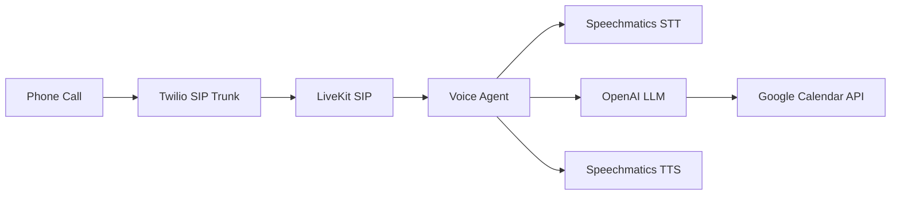

# AI Receptionist - Voice Agent with Google Calendar

**An intelligent voice agent that handles inbound calls, books appointments to Google Calendar, and answers business questions.**

Learn how to build a production-ready AI receptionist using LiveKit, Speechmatics STT/TTS, OpenAI function calling, and Google Calendar API.

## What You'll Learn

- Building voice agents with LiveKit Agents framework
- Twilio + LiveKit SIP integration for telephony
- LLM function calling for calendar operations
- Google Calendar API integration (check, book, cancel, reschedule)
- Custom vocabulary for business-specific terms
- Designing conversational flows for appointment booking

## Prerequisites

- **Speechmatics API Key**: Get one from [portal.speechmatics.com](https://portal.speechmatics.com/)
- **OpenAI API Key**: Get one from [platform.openai.com](https://platform.openai.com/)
- **LiveKit Cloud Account**: Sign up at [livekit.io](https://livekit.io/)
- **Twilio Account**: For phone number and SIP trunking at [twilio.com](https://www.twilio.com/)
- **Google Cloud Account**: For Calendar API access
- **Python 3.9+**

## Quick Start

### Python

**Step 1: Create and activate a virtual environment**

**On Windows:**
```bash
cd python
python -m venv venv
venv\Scripts\activate
```

**On Mac/Linux:**
```bash
cd python
python3 -m venv venv
source venv/bin/activate
```

**Step 2: Install dependencies**

```bash
pip install -r requirements.txt
```

**Step 3: Set up Google Calendar**

See [Google Calendar Setup](#google-calendar-setup) below.

**Step 4: Configure environment**

```bash
cp ../.env.example .env
# Edit .env and add your API keys
```

**Step 5: Customize the agent**

Edit `assets/agent.md` with your business name, services, and hours.

**Step 6: Run the agent**

```bash
python main.py dev
```

## How It Works

> [!NOTE]
> This example demonstrates a complete voice agent with:
>
> 1. **LiveKit SIP Integration** - Receive phone calls via Twilio
> 2. **Speechmatics STT/TTS** - High-quality speech recognition and synthesis
> 3. **OpenAI Function Calling** - LLM determines when to call calendar functions
> 4. **Google Calendar API** - Real appointment management



## Available Functions

| Function | Description | Example Trigger |
|----------|-------------|-----------------|
| `get_current_datetime` | Get current date/time | Called automatically |
| `check_availability` | Check open slots | "What's available Tuesday?" |
| `book_appointment` | Create appointment | "Book me for 3pm" |
| `cancel_appointment` | Cancel booking | "I need to cancel" |
| `reschedule_appointment` | Move to new time | "Reschedule to Monday" |

## Code Walkthrough

### 1. Agent Setup (main.py)

Configure LiveKit with Speechmatics STT/TTS:

```python
from livekit.agents import Agent, AgentSession
from livekit.plugins import openai, speechmatics

from calendar_tools import CALENDAR_TOOLS

stt = speechmatics.STT(
    enable_diarization=True,
    operating_point="enhanced",
    enable_partials=True,
    focus_speakers=["S1"],
    end_of_utterance_silence_trigger=0.5,
    max_delay=0.7,
    additional_vocab=[
        speechmatics.AdditionalVocabEntry(content="Swedish Massage"),
        speechmatics.AdditionalVocabEntry(content="Deep Tissue Massage"),
        speechmatics.AdditionalVocabEntry(content="AM", sounds_like=["A M", "a.m."]),
    ],
)

llm = openai.LLM(model="gpt-4o")
tts = speechmatics.TTS(voice="megan")

receptionist = Agent(
    instructions=load_agent_prompt(),
    tools=CALENDAR_TOOLS,
)
```

> [!NOTE]
> Key STT settings:
> - `enable_diarization` - Identify different speakers
> - `operating_point="enhanced"` - Higher accuracy mode
> - `focus_speakers=["S1"]` - Focus on caller, ignore TTS playback
> - `end_of_utterance_silence_trigger=0.5` - Faster turn detection

### 2. Calendar Functions (calendar_tools.py)

The calendar tools use Google Calendar API with a service account. Here's how they work:

#### Helper Functions

```python
# Lazy-loaded calendar service (singleton)
def get_calendar():
    """Initialize Google Calendar API once, reuse for all calls."""

# Date parsing with auto-correction
def parse_date(date_str: str) -> datetime:
    """Parse ISO date, auto-correct past years (e.g., 2023 → 2025)."""

# Time parsing with multiple formats
def parse_time(time_str: str) -> datetime:
    """Parse '3:00 PM', '3pm', '15:00' formats."""

# Availability check using freebusy API
def is_slot_available(calendar, start, end) -> bool:
    """Query Google Calendar freebusy endpoint."""

# Find existing appointments by customer name
def find_customer_appointment(calendar, customer_name, date=None):
    """Search events by name, from start of today (not current time)."""
```

#### Function Tools

```python
@function_tool()
async def check_availability(context, date, time_of_day=None, specific_time=None):
    """
    Two modes:
    1. General: time_of_day="afternoon" → suggests 2-3 spread out times
    2. Specific: specific_time="3:00 PM" → returns yes/no
    """

@function_tool()
async def book_appointment(context, date, time, customer_name, customer_phone, service_type=None):
    """
    1. Check slot still available (race condition protection)
    2. Create event with customer details in description
    """

@function_tool()
async def cancel_appointment(context, customer_name, date=None):
    """Search by name, delete first matching event."""

@function_tool()
async def reschedule_appointment(context, customer_name, new_date, new_time, old_date=None):
    """Find existing → check new slot → update event."""
```

> [!TIP]
> Use `time_of_day` ("morning", "afternoon", "evening") for suggestions, or `specific_time` ("3:00 PM") to check a specific slot.

#### Business Hours

Configured in the `check_availability` function:

```python
hours = {
    "morning": (9, 12),    # 9 AM - 12 PM
    "afternoon": (12, 17), # 12 PM - 5 PM
    "evening": (17, 19),   # 5 PM - 7 PM
}
# No time_of_day specified = full day (9 AM - 7 PM)
```

#### Date Correction

The LLM sometimes sends past dates. `parse_date()` auto-corrects:

```python
# LLM sends "2023-12-02" (past year)
# Corrected to "2025-12-02" (current year)

# If still in past (e.g., January when it's December)
# Corrected to next year
```

### 3. Custom Vocabulary

Add business-specific terms for better recognition:

```python
additional_vocab=[
    # Days with sounds_like
    speechmatics.AdditionalVocabEntry(content="Tuesday", sounds_like=["Tues", "chews day"]),
    # Services
    speechmatics.AdditionalVocabEntry(content="Hot Stone Therapy"),
    speechmatics.AdditionalVocabEntry(content="Sports Massage"),
]
```

## Google Calendar Setup

### 1. Create Google Cloud Project

1. Go to [Google Cloud Console](https://console.cloud.google.com/)
2. Create a new project
3. **Enable Google Calendar API**:
   - APIs & Services → Library → Search "Google Calendar API" → Enable
   - Wait 1-2 minutes for propagation

### 2. Create Service Account

1. APIs & Services → Credentials
2. Create Credentials → Service Account
3. Name it (e.g., "ai-receptionist")
4. Click Done

### 3. Generate Credentials

1. Click on the service account
2. Keys tab → Add Key → Create new key
3. Select JSON → Create
4. Save as `credentials.json` in `python/` folder

### 4. Share Calendar

1. Open [Google Calendar](https://calendar.google.com/)
2. Calendar settings → Share with specific people
3. Add service account email (`name@project.iam.gserviceaccount.com`)
4. Set "Make changes to events"

### 5. Configure Environment

```bash
GOOGLE_SERVICE_ACCOUNT_FILE=credentials.json
GOOGLE_CALENDAR_ID=your.email@gmail.com
TIMEZONE=Europe/London
APPOINTMENT_DURATION_MINUTES=60
```

## Twilio + LiveKit SIP Setup

To receive phone calls, you need to connect Twilio to LiveKit via SIP trunking.

### 1. Create LiveKit Inbound Trunk

1. Go to [LiveKit Cloud Console](https://cloud.livekit.io/)
2. Navigate to **Telephony Configuration** → **SIP Trunks**
3. Click **Create SIP Trunk**
4. Configure:
   - **Trunk name**: Give it a name (e.g., "Twilio Inbound")
   - **Trunk direction**: Select **Inbound**
   - **Numbers**: Enter your Twilio phone number (e.g., `+14155551234`)
   - **Allowed addresses**: Leave as `0.0.0.0/0` to allow all IPs
5. Click **Create** and copy the SIP URI (e.g., `sip:xxxxx.sip.livekit.cloud`)

### 2. Create Twilio Elastic SIP Trunk

1. Go to [Twilio Console](https://console.twilio.com/)
2. Navigate to **Elastic SIP Trunking** → **Trunks**
3. Click **Create new SIP Trunk**
4. Give it a name (e.g., "LiveKit Voice Assistant")

### 3. Configure Twilio Origination (Inbound Calls)

Point Twilio to your LiveKit SIP endpoint:

1. In your Twilio SIP trunk, go to **Origination**
2. Add an Origination URI:
   - **Origination SIP URI**: Paste the LiveKit SIP URI from Step 1
   - **Priority**: `1`
   - **Weight**: `1`
   - **Enabled**: Yes
3. Save the configuration

### 4. Associate Phone Number in Twilio

1. In your Twilio SIP trunk, go to **Phone Numbers**
2. Click **Add a Phone Number**
3. Select your Twilio phone number
4. Save the configuration

### 5. Create LiveKit Dispatch Rule

Route incoming calls to your agent:

1. Go to [LiveKit Cloud Console](https://cloud.livekit.io/)
2. Navigate to **Telephony Configuration** → **Dispatch Rules**
3. Click **Create Dispatch Rule**
4. Configure:
   - **Trunk**: Select the inbound trunk you created in Step 1
   - **Rule Type**: **Individual** (creates a room per call)
   - **Room Prefix**: `call-` (or any prefix you prefer)
5. Save the configuration

> [!TIP]
> Test your setup by calling your Twilio phone number. You should see a new room created in LiveKit with the prefix you configured.

## Expected Output

### Example Conversation

```
Agent: "Good morning, thanks for calling Speechmatics Awesome Massage.
        How can I help you today?"

Caller: "Hi, I'd like to book a sports massage for Tuesday afternoon"

Agent: "Let me check Tuesday afternoon for you... I have openings at
        12:00 PM, 2:30 PM, and 4:30 PM. Which works best?"

Caller: "What about 3pm?"

Agent: "Yes, 3:00 PM on Tuesday is available! Would you like to book it?"

Caller: "Yes please"

Agent: "Great! Can I get your name?"

Caller: "John Smith"

Agent: "Thanks John. And a phone number?"

Caller: "07700 900123"

Agent: "Perfect. I've booked you for Tuesday, December 2nd at 3:00 PM
        for a sports massage. See you then, John!"
```

### Console Output

```
[DEBUG] get_current_datetime called
[DEBUG] check_availability: date='2025-12-02', time_of_day=afternoon
[DEBUG] Available slots: ['12:00', '12:30', '13:00', '14:30', '15:00', '16:00']
[DEBUG] check_availability: date='2025-12-02', specific_time=3:00 PM
[DEBUG] Slot available: True
[DEBUG] book_appointment: John Smith, 2025-12-02, 3:00 PM
```

## Use Cases

### Hair Salon

```python
additional_vocab=[
    speechmatics.AdditionalVocabEntry(content="balayage", sounds_like=["bala yazh"]),
    speechmatics.AdditionalVocabEntry(content="keratin treatment"),
]
# APPOINTMENT_DURATION_MINUTES=90
```

### Dental Office

```python
additional_vocab=[
    speechmatics.AdditionalVocabEntry(content="cleaning"),
    speechmatics.AdditionalVocabEntry(content="root canal"),
    speechmatics.AdditionalVocabEntry(content="Dr. Johnson"),
]
# APPOINTMENT_DURATION_MINUTES=30
```

## Troubleshooting

**"Calendar not configured"**
- Check `credentials.json` exists in `python/`
- Verify `GOOGLE_SERVICE_ACCOUNT_FILE` path in `.env`

**"403 - Google Calendar API has not been used"**
- Enable Calendar API in Google Cloud Console
- Wait 1-2 minutes after enabling

**"Permission denied"**
- Share calendar with service account email
- Set "Make changes to events" permission

**"No appointment found"**
- Customer name must match event title
- Search starts from today 00:00, not current time

**Agent uses wrong year (e.g., 2023)**
- `get_current_datetime` tool tells LLM the current date
- Date parser auto-corrects past years to current year

## Resources

- [LiveKit Agents Documentation](https://docs.livekit.io/agents/)
- [LiveKit SIP Telephony](https://docs.livekit.io/sip/)
- [Twilio Elastic SIP Trunking](https://www.twilio.com/docs/sip-trunking)
- [Speechmatics LiveKit Plugin](https://docs.livekit.io/agents/plugins/speechmatics/)
- [Google Calendar API](https://developers.google.com/calendar/api)
- [OpenAI Function Calling](https://platform.openai.com/docs/guides/function-calling)

---

**Time to Complete**: 30 minutes
**Difficulty**: Intermediate
**API Mode**: LiveKit Voice Agent
**Languages**: Python

[Back to Use Cases](../README.md) | [Back to Academy](../../README.md)
