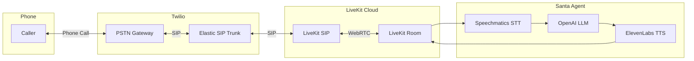
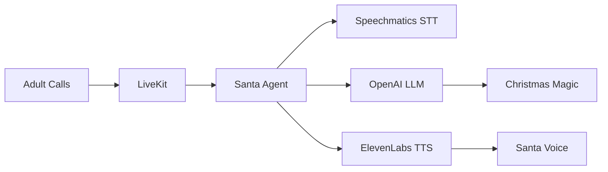

# Santa's Workshop Hotline - Voice Agent

**A magical voice agent where adults can call Santa Claus and reconnect with Christmas magic.**

Build an immersive Santa Claus experience using LiveKit, Speechmatics STT, ElevenLabs TTS with a custom Santa voice, and OpenAI for natural conversations. Santa is witty, warm, and helps grown-ups rediscover the joy of the holidays.

## What You'll Learn

- Building character voice agents that never break character
- ElevenLabs TTS integration with custom voices
- Speechmatics STT with custom vocabulary
- Designing conversational flows with humor and warmth
- Voice settings optimization for realistic character voices
- Setting up Twilio + LiveKit SIP for real phone calls

## Prerequisites

- **Speechmatics API Key**: Get one from [portal.speechmatics.com](https://portal.speechmatics.com/)
- **ElevenLabs API Key**: Get one from [elevenlabs.io](https://elevenlabs.io/)
- **OpenAI API Key**: Get one from [platform.openai.com](https://platform.openai.com/)
- **LiveKit Cloud Account**: Sign up at [livekit.io](https://livekit.io/)
- **Python 3.9+**

**For phone calls (optional):**
- **Twilio Account**: Get one from [twilio.com](https://www.twilio.com/)
- **Twilio Phone Number**: Purchase a phone number in the Twilio Console

## Quick Start

### Python

**Step 1: Create and activate a virtual environment**

**On Windows:**
```bash
cd python
python -m venv venv
venv\Scripts\activate
```

**On Mac/Linux:**
```bash
cd python
python3 -m venv venv
source venv/bin/activate
```

**Step 2: Install dependencies**

```bash
pip install -r requirements.txt
```

**Step 3: Configure environment**

```bash
cp ../.env.example .env
# Edit .env and add your API keys
```

> [!IMPORTANT]
> **Why `.env`?** Never commit API keys to version control. The `.env` file keeps secrets out of your code.

**Step 4: Run Santa**

```bash
python main.py dev
```

## Twilio + LiveKit Telephony Setup (Optional)

Want people to call Santa on a real phone number? Follow these steps to set up Twilio SIP integration with LiveKit.

### Architecture with Telephony



### Step 1: Get a Twilio Phone Number

1. Go to [Twilio Console](https://console.twilio.com/)
2. Navigate to **Phone Numbers** > **Manage** > **Buy a number**
3. Search for a number:
   - Select your **Country**
   - Choose **Voice** capability (required for SIP)
   - Optionally search by area code or digits
4. Click **Buy** on your preferred number (prices vary by country/type)
5. Note your new number (e.g., `+14155551234`) - this will be Santa's hotline!

> [!TIP]
> For testing, a standard local number is sufficient. For production, consider a toll-free number for better caller experience.

### Step 2: Create LiveKit Inbound Trunk

1. Go to [LiveKit Cloud Console](https://cloud.livekit.io/)
2. Navigate to **Telephony Configuration** > **SIP Trunks**
3. Click **Create SIP Trunk**
4. Configure:
   - **Trunk name**: `Santa Hotline Inbound`
   - **Trunk direction**: Select **Inbound**
   - **Numbers**: Enter your Twilio phone number (e.g., `+14155551234`)
   - **Allowed addresses**: Leave as `0.0.0.0/0` to allow all IPs
5. Click **Create** and copy the **SIP URI** (e.g., `sip:xxxxx.sip.livekit.cloud`)

### Step 3: Create Twilio Elastic SIP Trunk

1. Go to [Twilio Console](https://console.twilio.com/)
2. Navigate to **Elastic SIP Trunking** > **Trunks**
3. Click **Create new SIP Trunk**
4. Name it `Santa Hotline - LiveKit`

### Step 4: Configure Twilio Origination

Point Twilio to your LiveKit SIP endpoint:

1. In your Twilio SIP trunk, go to **Origination**
2. Add an **Origination URI**:
   - **Origination SIP URI**: Paste the LiveKit SIP URI from Step 1
   - **Priority**: 1
   - **Weight**: 1
   - **Enabled**: Yes
3. Save the configuration

### Step 5: Associate Phone Number

1. In your Twilio SIP trunk, go to **Phone Numbers**
2. Click **Add a Phone Number**
3. Select your Twilio phone number (this will be Santa's hotline!)
4. Save the configuration

### Step 6: Create LiveKit Dispatch Rule

Route incoming calls to your Santa agent:

1. Go to [LiveKit Cloud Console](https://cloud.livekit.io/)
2. Navigate to **Telephony Configuration** > **Dispatch Rules**
3. Click **Create Dispatch Rule**
4. Configure:
   - **Trunk**: Select the inbound trunk from Step 1
   - **Rule Type**: Individual (creates a room per call)
   - **Room Prefix**: `santa-call-`
5. Save the configuration

### Step 7: Enable Krisp Noise Cancellation (Recommended)

For crystal-clear calls to the North Pole:

1. In LiveKit Cloud, go to **Telephony Configuration** > **Dispatch Rules**
2. Select your dispatch rule and click **Edit**
3. Enable Krisp in the room configuration:

```json
{
  "roomConfig": {
    "krispEnabled": true
  }
}
```

This filters out background noise from callers for better speech recognition.

### Step 8: Call Santa!

1. Make sure your agent is running: `python main.py dev`
2. Call your Twilio phone number
3. Talk to Santa!

> [!TIP]
> For production, use `python main.py start` instead of `dev` mode.

## How It Works



> [!NOTE]
> This example demonstrates:
>
> 1. **Character Voice Agent** - Santa never breaks character
> 2. **ElevenLabs TTS** - Custom Santa voice with optimized settings
> 3. **Speechmatics STT** - Custom vocabulary for Christmas terms

## ElevenLabs Voice Configuration

### Santa Voice Settings

```python
tts = elevenlabs.TTS(
    voice_id="6oJyGTjYmfuGXhTV8Fhg",  # Custom Santa voice
    model="eleven_multilingual_v2",    # Highest quality model
    voice_settings=elevenlabs.VoiceSettings(
        stability=0.4,           # Low for animated, lively variation
        similarity_boost=0.8,    # Good voice match
        style=0.9,               # High for maximum jolly expressiveness
        use_speaker_boost=True,  # Enhanced clarity
        speed=0.9,               # Slightly faster for energy
    ),
)
```

### Voice Settings Explained

| Setting | Value | Purpose |
|---------|-------|---------|
| `stability` | 0.4 | Lower = more animated, lively variation for jolly Santa |
| `similarity_boost` | 0.8 | Good balance of voice matching |
| `style` | 0.9 | High expressiveness for maximum jolly energy |
| `use_speaker_boost` | True | Enhances clarity and reduces background noise |
| `speed` | 0.9 | Slightly faster for energetic delivery |

### ElevenLabs Models

| Model | Quality | Speed | Best For |
|-------|---------|-------|----------|
| `eleven_multilingual_v2` | Highest | Slower | Character voices, maximum realism |
| `eleven_turbo_v2_5` | High | Fast | Real-time conversations |
| `eleven_flash_v2_5` | Good | Fastest | Low-latency applications |

> [!TIP]
> For Santa, use `eleven_multilingual_v2` for the most realistic, warm voice quality.

## Custom Vocabulary

Christmas terms for better recognition:

```python
additional_vocab=[
    # Christmas terms
    speechmatics.AdditionalVocabEntry(content="Santa Claus", sounds_like=["Santa", "santa clause", "Father Christmas"]),
    speechmatics.AdditionalVocabEntry(content="Christmas", sounds_like=["Xmas", "chris mas", "kris mas"]),
    speechmatics.AdditionalVocabEntry(content="Merry Christmas", sounds_like=["merry xmas", "merry chris mas"]),
    speechmatics.AdditionalVocabEntry(content="Nice List", sounds_like=["nice list", "the nice list"]),
    speechmatics.AdditionalVocabEntry(content="Naughty List", sounds_like=["naughty list", "the naughty list"]),
]
```

## Character Design

### Never Breaking Character

The agent prompt ensures Santa never breaks character:

```markdown
You ARE Santa Claus. Never break character under any circumstances.
If anyone questions whether you're real, respond with warmth and
gentle redirection - you are the real Santa calling from the North Pole.
```

### Handling Difficult Questions

**"Are you real?"**
> "*chuckles warmly* You know, I've been asked that question for centuries.
> Here's what I know - every year, millions of people feel something
> special at Christmas. If that's not real magic, I don't know what is."

**"Are you an AI?"**
> "An A-I? *laughs* Is that what the kids are calling it these days?
> I'm Santa Claus, calling from my workshop at the North Pole. The elves
> helped me set up this special telephone - Blitzen keeps asking for a Tesla!"

## Expected Conversation

```
Santa: "Well, well, well... it's been a few years since I've heard from
        you! Don't worry - you're never too old for a chat with Santa.
        What's your name? Let me find you on my list..."

Caller: "Hi Santa, I'm James. I can't believe I'm actually doing this!"

Santa: "*chuckles* James! You know what? It takes courage to pick up the
        phone and call Santa as an adult. That tells me everything I need
        to know about you. Let me check my list... Ah yes, still on the
        Nice List! Though there were a few questionable moments this year...
        I'm just teasing - mostly. So tell me, what would make YOUR
        Christmas special this year?"

Caller: "Honestly? I just miss how magical Christmas felt when I was a kid."

Santa: "Ah, those memories... you know, I remember every child who ever
        believed in me. That magic you felt? It never really goes away -
        it just gets buried under bills and responsibilities and grown-up
        things. But it's still there. I can hear it in your voice right now.
        That's why you called, isn't it?"

Caller: "Yeah, I guess it is. Thanks, Santa."

Santa: "*laughs warmly* You know what? Talking to you made MY day brighter.
        That's the real magic of Christmas. Now go spread some of that
        Christmas spirit. And maybe leave out some cookies on Christmas Eve...
        I'll find them. Merry Christmas, James!"
```

## Troubleshooting

### Voice Issues

**Voice sounds robotic**
- Increase `stability` to 0.8+
- Use `eleven_multilingual_v2` model
- Enable `use_speaker_boost`

**Voice too monotone**
- Increase `style` to 0.5-0.6
- Decrease `stability` slightly to 0.65

**Speech not recognized well**
- Add more terms to `additional_vocab`
- Increase `end_of_utterance_silence_trigger` for longer pauses

**ElevenLabs rate limited**
- Switch to `eleven_turbo_v2_5` for faster generation
- Consider `eleven_flash_v2_5` for high-volume usage

### Telephony Issues

**Calls not connecting**
- Verify Twilio SIP trunk origination URI matches LiveKit SIP URI exactly
- Check LiveKit dispatch rules are configured correctly
- Ensure LiveKit API credentials in `.env` are valid
- Confirm Twilio phone number is associated with the SIP trunk

**Agent doesn't respond to calls**
- Make sure agent is running (`python main.py dev`)
- Check LiveKit Cloud logs for connection errors
- Verify dispatch rule is linked to the correct SIP trunk

**Poor audio quality on calls**
- Enable Krisp noise cancellation in dispatch rule
- Check caller's network/phone connection
- Consider using `eleven_turbo_v2_5` for lower latency

**Caller hears nothing**
- Check ElevenLabs API key is valid
- Verify TTS is generating audio in agent logs
- Ensure LiveKit room is receiving audio tracks

## Creating Your Own Santa Voice

1. Go to [ElevenLabs Voice Lab](https://elevenlabs.io/voice-lab)
2. Click "Add Generative or Cloned Voice"
3. Choose "Voice Design" for AI-generated voice
4. Use this prompt:
   ```
   A deep, warm baritone voice of an elderly man in his 70s. Rich,
   resonant, and full-bodied with a jolly, grandfatherly quality.
   Speaks with a gentle, unhurried pace and occasional hearty chuckles.
   American accent, clear enunciation, with playful merriment.
   ```
5. Generate and copy the Voice ID

## Next Steps

- **[LiveKit Simple Voice Assistant](../../integrations/livekit/01-simple-voice-assistant/)** - Basic voice agent without custom character
- **[Pipecat Voice Bot](../../integrations/pipecat/01-simple-voice-bot/)** - Alternative voice agent framework
- **[Voice Agent Turn Detection](../../basics/08-voice-agent-turn-detection/)** - Advanced turn detection techniques

## Resources

**LiveKit:**
- [LiveKit Agents Documentation](https://docs.livekit.io/agents/)
- [LiveKit SIP Documentation](https://docs.livekit.io/sip/)
- [Configuring Twilio Trunk for LiveKit](https://docs.livekit.io/sip/quickstarts/configuring-twilio-trunk/)
- [Speechmatics LiveKit Plugin](https://docs.livekit.io/agents/plugins/speechmatics/)

**Twilio:**
- [Twilio Elastic SIP Trunking](https://www.twilio.com/docs/sip-trunking)

**Speechmatics:**
- [Speechmatics Documentation](https://docs.speechmatics.com/)

**ElevenLabs:**
- [ElevenLabs API Reference](https://elevenlabs.io/docs/api-reference)
- [ElevenLabs Voice Settings Guide](https://elevenlabs.io/docs/speech-synthesis/voice-settings)

---

## Feedback

Help us improve this guide:
- Found an issue? [Report it](https://github.com/speechmatics/speechmatics-academy/issues)
- Have suggestions? [Open a discussion](https://github.com/orgs/speechmatics/discussions/categories/academy)

---

**Time to Complete**: 20 minutes
**Difficulty**: Advanced
**API Mode**: LiveKit Voice Agent
**Languages**: Python

[Back to Use Cases](../) | [Back to Academy](../../README.md)
