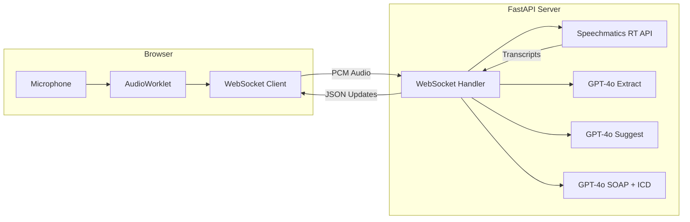

# Medical Assistant - Real-Time Clinical Transcription

**Live bilingual (Arabic + English) medical transcription with speaker diarization, AI form extraction, clinical decision support, and SOAP note generation.**

Combines Speechmatics Real-Time API for speech-to-text with OpenAI GPT-4o for structured medical data extraction — all in a full-stack web application with a three-panel clinical dashboard.

## What You'll Learn

- Real-time bilingual transcription with `ar_en` (Arabic + English) language pack
- Speaker diarization to identify Doctor vs Patient in clinical conversations
- Medical domain configuration with custom vocabulary (English + Arabic terms)
- Turn detection using end-of-utterance events for transcript grouping
- Streaming audio from browser microphone via AudioWorklet API
- Building a WebSocket pipeline: Browser → FastAPI → Speechmatics RT API
- Combining speech-to-text output with LLM-based entity extraction

## Prerequisites

- **Speechmatics API Key**: Get one from [portal.speechmatics.com](https://portal.speechmatics.com/)
- **OpenAI API Key**: Get one from [platform.openai.com](https://platform.openai.com/)
- **Python 3.11+**
- A modern browser with microphone access (Chrome, Edge, Firefox)

## Quick Start

**Step 1: Create and activate a virtual environment**

**On Windows:**
```bash
python -m venv venv
venv\Scripts\activate
```

**On Mac/Linux:**
```bash
python3 -m venv venv
source venv/bin/activate
```

**Step 2: Install dependencies**

```bash
pip install -r requirements.txt
```

**Step 3: Configure your API keys**

```bash
cp .env.example .env
# Edit .env and add your SPEECHMATICS_API_KEY and OPENAI_API_KEY
```

> [!IMPORTANT]
> **Why `.env`?** Never commit API keys to version control. The `.env` file keeps secrets out of your code.

**Step 4: Run the application**

```bash
uvicorn backend.main:app --port 7860 --reload
```

Open **http://localhost:7860** in your browser.

> [!TIP]
> Click **Run Demo** to test the full pipeline without a microphone. The demo simulates a bilingual doctor-patient encounter and triggers all AI features.

## How It Works

> [!NOTE]
> This application combines three services in real-time:
>
> 1. **Capture** — Browser records microphone audio via AudioWorklet (16kHz, mono, PCM 16-bit)
> 2. **Stream** — Audio chunks are sent over WebSocket to the FastAPI backend
> 3. **Transcribe** — Backend streams audio to Speechmatics RT API with speaker diarization
> 4. **Extract** — Final transcripts are forwarded to GPT-4o for medical entity extraction
> 5. **Display** — Structured data populates the form, suggestions panel, SOAP notes, and ICD-10 codes

### Architecture



### Speechmatics Configuration

```python
from speechmatics.rt import (
    AsyncClient,
    TranscriptionConfig,
    AudioFormat,
    AudioEncoding,
    OperatingPoint,
    SpeakerDiarizationConfig,
    ConversationConfig,
)

config = TranscriptionConfig(
    language="ar_en",                         # Bilingual Arabic + English
    operating_point=OperatingPoint.ENHANCED,   # Maximum accuracy for medical terms
    enable_partials=True,                      # Show text as it's spoken
    max_delay=2.0,                             # Low-latency streaming
    enable_entities=True,                      # Structured entity recognition
    domain="medical",                          # Medical-optimized language pack
    additional_vocab=[
        {"content": "hypertension", "sounds_like": ["high per tension"]},
        {"content": "tachycardia", "sounds_like": ["tacky cardia"]},
        {"content": "SpO2", "sounds_like": ["S P O 2", "spo two"]},
        {"content": "echocardiogram", "sounds_like": ["echo cardio gram"]},
        # Arabic medical terms
        {"content": "ضغط الدم", "sounds_like": ["daght al dam"]},
        {"content": "نبض القلب", "sounds_like": ["nabd al qalb"]},
    ],
    conversation_config=ConversationConfig(
        end_of_utterance_silence_trigger=0.8,  # Turn detection at 800ms silence
    ),
)

# Speaker diarization for Doctor vs Patient
config.diarization = "speaker"
config.speaker_diarization_config = SpeakerDiarizationConfig(max_speakers=2)

audio_format = AudioFormat(
    encoding=AudioEncoding.PCM_S16LE,
    sample_rate=16000,
)
```

> [!TIP]
> **For medical transcription**, always use `domain="medical"` and `operating_point=OperatingPoint.ENHANCED`. The medical domain includes a specialized language pack optimized for clinical terminology, drug names, and medical procedures.

### Speaker Role Inference

The application identifies who is speaking using:

1. **Speechmatics diarization** — assigns speaker IDs (S1, S2)
2. **Pattern matching** — clinical language patterns in both English and Arabic determine doctor vs patient
3. **Speaker history** — once identified, roles persist for the session

### Debounced LLM Extraction

To avoid excessive API calls during continuous speech:

- 1.5 second delay after each final transcript before calling GPT-4o
- Extraction and suggestion generation run concurrently with `asyncio.gather`
- Final extraction runs when recording stops to capture all remaining data

## Expected Output

When you click **Run Demo**, the application simulates a bilingual clinical encounter:

```
TRANSCRIPT PANEL:
  [DR] المريض is a 45 year old male presenting with chest pain.
  [DR] ضغط الدم 140 over 90. نبض القلب 88 beats per minute, regular rhythm.
  [DR] حرارة 37.2 degrees Celsius. الأكسجين saturation 98 percent.
  [PT] I feel shortness of breath و دوخة when I walk.
  [DR] الفحص shows mild bilateral leg edema.
  [PT] أنا عندي diabetes and السكري hypertension. No known allergies.
  [DR] متابعة recommended in 2 weeks. Discharge is recommended.

FORM PANEL (auto-filled):
  BP: 140/90 | HR: 88 bpm | Temp: 37.2°C | SpO2: 98%
  Symptoms: chest pain, shortness of breath, dizziness, edema
  Action: Follow-up | Discharge: Yes

SUGGESTIONS PANEL:
  Questions to Ask: [AI-generated follow-up questions]
  Potential Diagnoses: [AI-generated differential diagnoses]
  Recommended Tests: [AI-generated test suggestions]
  Medications: [AI-generated medication considerations]

SOAP NOTE (on Generate):
  S - Subjective: Patient reports chest pain, shortness of breath...
  O - Objective: BP 140/90, HR 88, Temp 37.2°C, SpO2 98%...
  A - Assessment: Possible cardiovascular involvement...
  P - Plan: Follow-up in 2 weeks, cardiac workup...

ICD-10 CODES:
  I10 - Essential hypertension (90%)
  R06.0 - Dyspnea (85%)
  R60.0 - Localized edema (80%)
```

## Key Features Demonstrated

**Speechmatics Real-Time Features:**
- Bilingual `ar_en` transcription (Arabic + English in single stream)
- Speaker diarization with `max_speakers=2`
- Medical domain with `domain="medical"`
- Custom vocabulary with `sounds_like` phonetic hints
- Partial transcripts for live typing indicators
- Turn detection via `end_of_utterance_silence_trigger`
- Enhanced operating point for maximum accuracy

**Full-Stack Application:**
- FastAPI WebSocket backend with session management
- Browser audio capture via AudioWorklet API (modern, non-deprecated)
- Three-panel clinical dashboard with dark theme
- Live reasoning stream showing AI processing steps
- Collapsible suggestion groups and SOAP note sections

## Configuration Options

| Parameter | Default | Options | Description |
|-----------|---------|---------|-------------|
| `language` | `ar_en` | `en`, `ar`, `ar_en` | Transcription language |
| `operating_point` | `ENHANCED` | `ENHANCED`, `STANDARD` | Accuracy vs speed tradeoff |
| `domain` | `medical` | `medical`, (none) | Medical vocabulary optimization |
| `max_speakers` | `2` | `1`–`20` | Maximum speakers for diarization |
| `end_of_utterance_silence_trigger` | `0.8` | `0.1`–`10.0` | Silence duration (seconds) to trigger turn end |
| `enable_partials` | `True` | `True`, `False` | Show real-time partial transcripts |
| `max_delay` | `2.0` | `0.5`–`10.0` | Maximum delay for transcript delivery |

> [!WARNING]
> The `max_speakers` parameter should match your use case. For clinical consultations, `2` (doctor + patient) is typical. Setting too high can reduce diarization accuracy.

## Project Structure

```
medical-assistant/
├── backend/
│   ├── __init__.py
│   ├── main.py                  # FastAPI app, WebSocket endpoints, session management
│   └── services/
│       ├── __init__.py
│       ├── transcription.py     # Speechmatics RT API client and session management
│       └── extraction.py        # GPT-4o extraction, suggestions, SOAP, ICD-10
├── frontend/
│   ├── index.html               # Three-panel layout (transcript, form, suggestions)
│   ├── css/
│   │   └── style.css            # Dark theme clinical dashboard
│   └── js/
│       ├── app.js               # Main application orchestrator
│       ├── audio.js             # Microphone capture + AudioWorklet + visualizer
│       ├── pcm-processor.js     # AudioWorklet processor (float32 → PCM 16-bit)
│       └── websocket.js         # WebSocket client for live and demo modes
├── .env.example                 # Environment variable template
├── requirements.txt             # Python dependencies
└── README.md
```

## WebSocket Message Protocol

**Client → Server:**

| Message | Description |
|---------|-------------|
| `{ type: "start" }` | Start transcription session |
| `{ type: "stop" }` | Stop transcription and trigger final extraction |
| `{ type: "pause" }` / `{ type: "resume" }` | Pause/resume audio processing |
| `{ type: "reset" }` | Clear transcript buffer and form data |
| `{ type: "generate_soap" }` | Request SOAP note + ICD-10 code generation |
| `{ type: "start_demo" }` | Start demo mode (simulated encounter) |
| Binary data | Raw PCM audio chunks (16-bit LE, 16kHz) |

**Server → Client:**

| Message | Description |
|---------|-------------|
| `partial` | Real-time partial transcript with speaker info |
| `final` | Confirmed transcript segment with diarization |
| `form_update` | Extracted medical form data (vitals, symptoms, etc.) |
| `suggestions_update` | AI clinical suggestions (questions, diagnoses, tests) |
| `soap_update` | Generated SOAP note (S/O/A/P sections) |
| `icd_codes_update` | Suggested ICD-10 diagnostic codes with confidence |
| `ai_processing` | Processing indicator start/stop |
| `reasoning` | Live reasoning stream messages |
| `end_of_utterance` | Turn detection event from Speechmatics |

## Next Steps

- **[01 - Medical Transcription (Real-Time)](../01-medical-transcription-realtime/)** — Simpler example focusing on real-time medical transcription with custom vocabulary
- **[03 - Call Center Analytics](../03-call-center-analytics/)** — Batch processing with speaker diarization and sentiment analysis

## Troubleshooting

**"Microphone access denied"**
- Ensure your browser has microphone permission for localhost
- Check browser settings → Privacy → Microphone

**"WebSocket connection failed"**
- Verify the server is running on port 7860
- Check the terminal for error messages

**"Authentication failed" or "Invalid API key"**
- Verify your `SPEECHMATICS_API_KEY` in `.env` is correct
- Ensure your Speechmatics account has Real-Time API access

**"OpenAI extraction not working"**
- Check your `OPENAI_API_KEY` in `.env`
- Verify you have GPT-4o access on your OpenAI account

**"Poor accuracy on medical terms"**
- Add domain-specific terms to `additional_vocab` in `transcription.py`
- Ensure `domain="medical"` and `operating_point=OperatingPoint.ENHANCED` are set

**"Demo mode works but live recording doesn't"**
- Demo mode doesn't require a Speechmatics API key (uses simulated transcripts)
- Live mode requires a valid Speechmatics API key with Real-Time access

## Resources

- [Speechmatics Real-Time API Documentation](https://docs.speechmatics.com/introduction/rt-guide)
- [Custom Vocabulary Guide](https://docs.speechmatics.com/features/custom-dictionary)
- [Speaker Diarization](https://docs.speechmatics.com/features/diarization)
- [Medical Domain](https://docs.speechmatics.com/speech-to-text/languages#healthcare-transcription)

---

## Feedback

Help us improve this guide:
- Found an issue? [Report it](https://github.com/speechmatics/speechmatics-academy/issues)
- Have suggestions? [Open a discussion](https://github.com/orgs/speechmatics/discussions/categories/academy)

---

**Time to Complete**: 15 minutes
**Difficulty**: Advanced
**API Mode**: Real-Time

[Back to Use Cases](../) | [Back to Academy](../../README.md)
