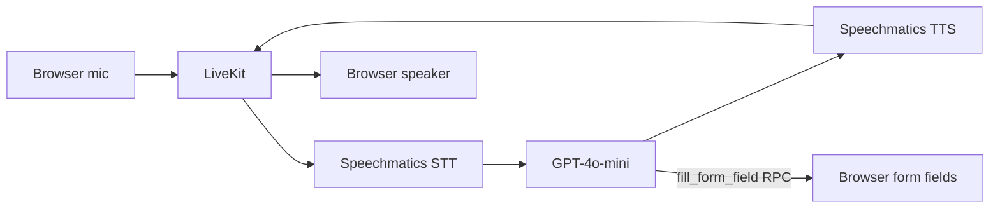

# Alphanumerics Voice Form Filler

**A real-time voice agent that listens to a user speak personal details — names, emails, phone numbers, post codes, account numbers — and fills a web form live, no typing required.**

Learn how to capture clean alphanumeric input over voice using Speechmatics real-time STT with smart turn detection, drive a browser DOM from an LLM via LiveKit RPC, and close the loop with Speechmatics TTS.

## What You'll Learn

- **Smart turn detection** with Speechmatics real-time STT — capture full utterances without polling or premature cut-offs.
- **LLM function-tool → LiveKit RPC → browser DOM** — a clean three-hop pattern that lets an LLM update a web UI directly.
- **Robust alphanumeric capture** — system-prompt rules so phone numbers, post codes, and account numbers are stored as one continuous digit string and read back digit-by-digit for confirmation.

## Prerequisites

- **Python 3.12+**
- **Speechmatics API Key** — sign up at [portal.speechmatics.com](https://portal.speechmatics.com/) and create a key under **API Keys**
- **OpenAI API Key** — get one from [platform.openai.com/api-keys](https://platform.openai.com/api-keys)
- **LiveKit Cloud account** — create a project at [cloud.livekit.io](https://cloud.livekit.io/) and generate API credentials (URL, API Key, API Secret)

## Quick Start

### Python

**Step 1: Create and activate a virtual environment**

**On Windows:**
```bash
cd python
python -m venv .venv
.venv\Scripts\activate
```

**On Mac/Linux:**
```bash
cd python
python3 -m venv .venv
source .venv/bin/activate
```

**Step 2: Install dependencies**

```bash
pip install -r requirements.txt
```

**Step 3: Configure environment**

```bash
cp ../.env.example ../.env
# Edit ../.env and add your real API keys
```

**Step 4: Run the web server (terminal 1)**

```bash
python server.py
```

Open [http://localhost:8000](http://localhost:8000) and click **Connect** (allow microphone access when prompted).

**Step 5: Run the voice agent (terminal 2)**

In a second terminal, with the same virtual environment activated:

```bash
python main.py connect --room alphanumerics-room
```

> [!IMPORTANT]
> Connect in the browser **before** starting the agent — the agent looks for a participant in the room when it joins, and the `fill_form_field` RPC needs a target participant to send to.

## How It Works



1. The browser joins a LiveKit room and streams microphone audio.
2. The agent transcribes speech with **Speechmatics real-time STT** using smart turn detection — it waits for end-of-utterance before flushing the transcript.
3. **GPT-4o-mini** interprets the transcript and decides whether to call `fill_form_field` for each detail it heard.
4. The agent issues a **LiveKit RPC** to the browser, which writes the value into the matching `<input>` element.
5. The agent speaks back via **Speechmatics TTS** and asks for the next field.

**Form fields:** first name · last name · email · phone · licence plate · account number · post code · city

## Code Walkthrough

### 1. Agent setup (`main.py`)

```python
from livekit.agents import Agent, AgentSession
from livekit.plugins import openai, silero, speechmatics
from livekit.plugins.speechmatics import TurnDetectionMode

stt = speechmatics.STT(turn_detection_mode=TurnDetectionMode.SMART_TURN)
llm = openai.LLM(model="gpt-4o-mini")
tts = speechmatics.TTS()
vad = silero.VAD.load()

session = AgentSession(stt=stt, llm=llm, tts=tts, vad=vad)
```

> [!NOTE]
> Omitting `base_url` lets the plugin default to the production endpoint `wss://eu2.rt.speechmatics.com/v2`. Set the `SPEECHMATICS_RT_URL` environment variable to override the region.

### 2. The bridge tool (`main.py`)

`fill_form_field` is the bridge between LLM intent and browser DOM. The LLM calls it, and it forwards the value to the browser via LiveKit RPC:

```python
@function_tool
async def fill_form_field(self, ctx: RunContext, field: str, value: str) -> str:
    room = ctx.session.room_io.room
    participant = ctx.session.room_io.linked_participant
    if not participant:
        return "No participant found to send RPC to."

    await room.local_participant.perform_rpc(
        destination_identity=participant.identity,
        method="fillFormField",
        payload=json.dumps({"field": field, "value": value}),
    )
    return f"Filled {field}: {value}"
```

### 3. Number-handling instructions

The system prompt tells the agent how to handle alphanumeric input:

> For numeric fields (phone, account_number, post_code), capture the digits as one continuous string with no spaces, commas, dashes, or word groupings — e.g. 'one two three four five' becomes 12345, never 12,345 or 'twelve thousand three hundred forty-five'. When reading any number back to the user to confirm, speak each digit individually as a single entity (e.g. 'one, two, three, four, five'), never as grouped numerals like 'twelve thousand'.

### 4. Browser side (`assets/index.html`)

The browser registers an RPC handler that writes incoming values into the matching `<input>` and turns it green:

```javascript
room.localParticipant.registerRpcMethod('fillFormField', async (data) => {
  const payload = JSON.parse(data.payload);
  const input = document.getElementById(payload.field);
  if (input) {
    input.value = payload.value;
    input.classList.add('filled');
  }
  return JSON.stringify({ success: true });
});
```

## Expected Output

When you click **Connect** in the browser:

1. The status indicator turns green: *Connected — room: alphanumerics-room*.
2. The agent greets you and asks for your details.
3. As you speak each field, the matching input fills with the value and turns green.
4. The fill log under the form shows the most recent action, e.g. *Agent filled phone: 5551234567*.

A complete pass through all eight fields takes around 60–90 seconds of conversation.

### Example interaction

```
Agent: "Hi! Please share your details and I'll fill in the form."

You:   "First name Anthony, last name Perera"
       → first_name and last_name fields fill in

You:   "My phone is five five five one two three four five six seven"
       → phone field fills in as 5551234567 (one continuous string)

Agent: "Got it — phone five, five, five, one, two, three, four, five,
        six, seven. What's your post code?"
       (Reads each digit individually for confirmation)
```

## Key Features Demonstrated

- **Speechmatics smart turn detection** — accurate end-of-utterance detection without manual VAD tuning.
- **Function-tool → RPC → DOM** — a generalisable pattern for letting an LLM drive a web UI live.
- **Alphanumeric robustness** — clean digit-string capture for IDs and codes, plus digit-by-digit read-back.
- **End-to-end real-time loop** — STT, LLM, TTS, and browser update all run with sub-second latency.

## Configuration Options

- **LLM**: swap `openai.LLM(model="gpt-4o-mini")` in `main.py` for any other LiveKit-supported LLM.
- **Region**: set `SPEECHMATICS_RT_URL` in `.env` or pass `base_url=` to `speechmatics.STT(...)` to target a different Speechmatics region.
- **Turn detection**: `TurnDetectionMode.SMART_TURN` is the default; see the [LiveKit Speechmatics plugin docs](https://docs.livekit.io/agents/plugins/speechmatics/) for alternatives.
- **Form fields**: extend the field list in the system prompt and the `fill_form_field` docstring, then add matching `<input>` elements in `assets/index.html`.

## Troubleshooting

**"Agent can't hear me / nothing transcribes"**
- Confirm the browser allowed microphone access and the status reads *Connected*.
- Refresh the page and click **Connect** again.

**"No participant found to send RPC to."**
- Start the browser session and click **Connect** *before* launching `main.py`. The agent looks for a linked participant when it joins the room.

**`AuthenticationError` from Speechmatics or OpenAI**
- Verify the keys in `.env` are correct and that the file lives in the example root (one level above `python/`).

**LiveKit connection failed**
- Confirm `LIVEKIT_URL` matches the project shown in the LiveKit dashboard and that the API key/secret pair belongs to the same project.

## Resources

- [Speechmatics docs](https://docs.speechmatics.com/)
- [Speechmatics real-time API reference](https://docs.speechmatics.com/rt-api-ref)
- [LiveKit Agents documentation](https://docs.livekit.io/agents/)
- [LiveKit Speechmatics plugin](https://docs.livekit.io/agents/plugins/speechmatics/)
- [OpenAI API reference](https://platform.openai.com/docs/api-reference)

---

## Feedback

Help us improve this guide:
- Found an issue? [Report it](https://github.com/speechmatics/speechmatics-academy/issues)
- Have suggestions? [Open a discussion](https://github.com/orgs/speechmatics/discussions/categories/academy)

---

**Time to Complete**: 10 minutes
**Difficulty**: Intermediate
**API Mode**: Real-time (LiveKit Voice Agent)
**Languages**: Python

[Back to Use Cases](../) | [Back to Academy](../../README.md)
