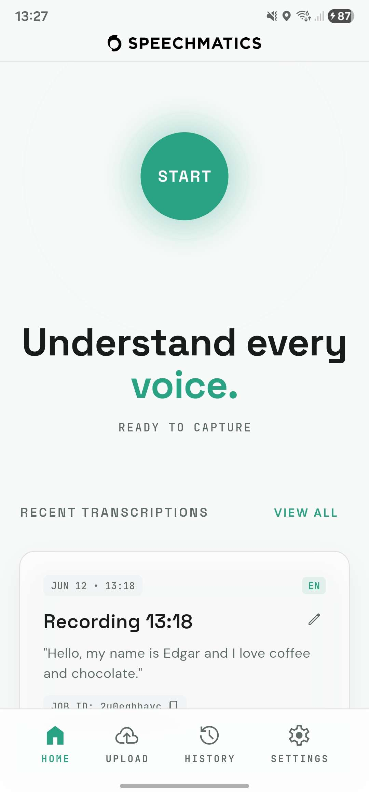
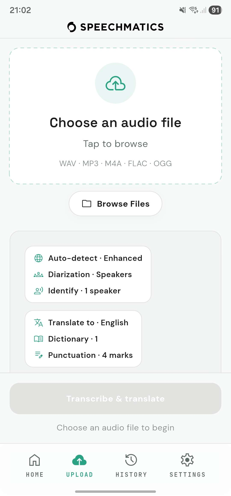
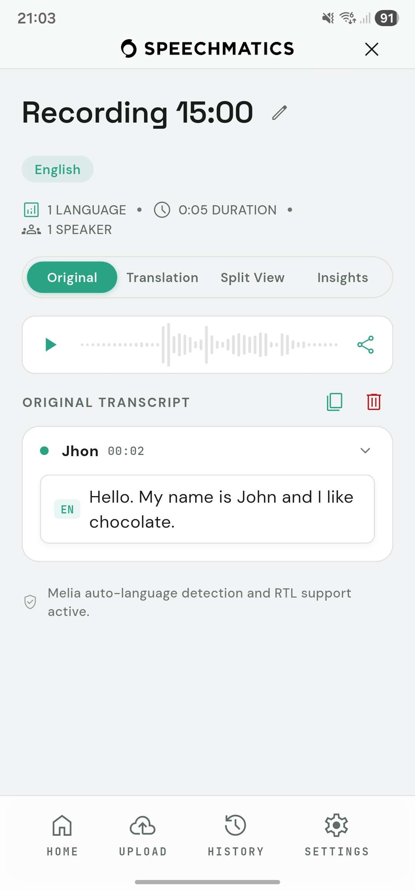
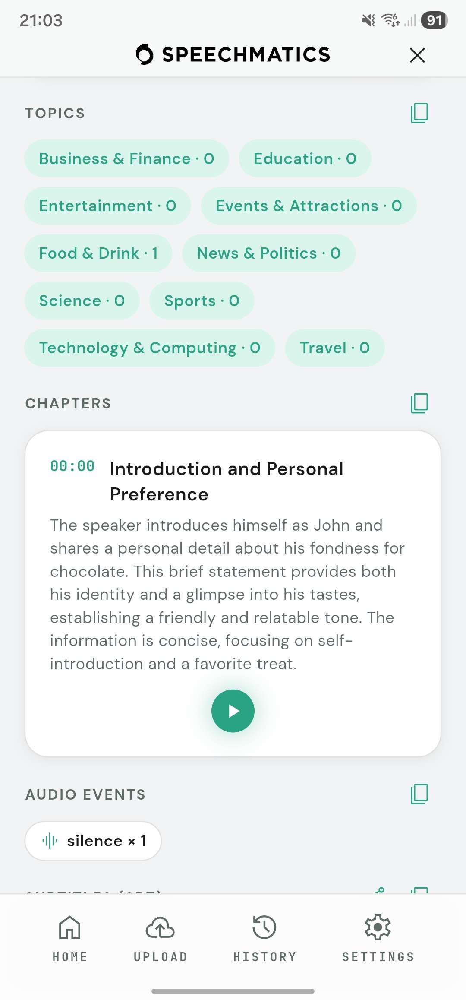
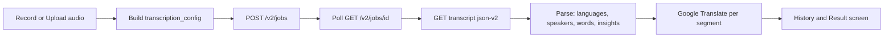

# Flutter Mobile Transcription App

**A cross-platform Flutter app (Android and iOS) that records or uploads audio, transcribes it with the Speechmatics Batch API, then translates, diarizes, and analyses it, all from a phone.**

This is the academy's first mobile example. It shows how to drive the Speechmatics Batch REST API end-to-end from a Flutter client: submit a job, poll it to completion, and render a rich result with multilingual transcription, speaker diarization and identification, translation, and speech-intelligence add-ons (summary, topics, chapters, subtitles). The full pipeline runs on-device against the cloud API, so no backend of your own is required.

<p align="center">
  
  
  
  
</p>

> [!NOTE]
> Omnilingual transcription in this app runs on **Melia 1**, Speechmatics' newest multilingual speech-to-text model. Melia handles code-switching across 55+ languages in a single file, so a recording that moves between languages comes back as one continuous transcript with no language to choose in advance and no language packs to manage. Pick it as **Melia-1** in Settings (the app sends `melia-1` to the Batch API), or choose the classic Enhanced or Standard models for single-language jobs.

## What You'll Learn

- **Calling the Speechmatics Batch API from a mobile client**: multipart job submission, fault-tolerant polling to completion, and fetching the `json-v2` transcript, with no SDK, just `http`.
- **Choosing the right model per job**: the omnilingual **Melia-1** model (one clip, many languages, code-switching) versus the classic **Enhanced** and **Standard** operating points, and how each maps to a different `transcription_config`.
- **Speaker diarization and identification**: labelling Speaker 1 and Speaker 2, plus enrolling a voice once (`get_speakers`) so future transcripts label that person by name.
- **Speech-intelligence add-ons**: summary, topic detection, auto-chapters, audio events, and SRT subtitles, requested per job and rendered in an Insights view.
- **Keeping secrets out of source**: supplying API keys via secure on-device storage or build-time `--dart-define`, never hardcoded.

## Prerequisites

- **Flutter SDK 3.4+** (developed on 3.44 / Dart 3.12). See the [install guide](https://docs.flutter.dev/get-started/install).
- **An Android device or emulator**, plus the **Android SDK** (bundled with [Android Studio](https://developer.android.com/studio)). iOS builds additionally require **macOS and Xcode**.
- **Speechmatics API Key**. Sign up at [portal.speechmatics.com](https://portal.speechmatics.com/) and create a key under **API Keys**. Jobs run against the paid Batch API, so check your plan's limits.
- **Google Cloud Translation v2 API Key** *(optional)*. Only needed for the translation feature; create one in the [Google Cloud Console](https://console.cloud.google.com/apis/credentials).

Verify your toolchain before you start:

```bash
flutter doctor
```

Resolve any Android-toolchain issues it reports (accept SDK licences with `flutter doctor --android-licenses`) before building.

## Quick Start

All commands run from the `flutter/` folder of this example.

```bash
cd flutter
flutter pub get
```

### Run on a connected Android phone

**Step 1: Enable developer mode on the phone**

On the device, open **Settings > About phone** and tap **Build number** seven times. Then open **Settings > Developer options** and enable **USB debugging**. Plug the phone in over USB and accept the "Allow USB debugging" prompt.

**Step 2: Confirm the device is visible**

```bash
flutter devices
```

Your phone should appear in the list. If it does not, check the cable and the on-device authorization prompt.

**Step 3: Run the app**

```bash
flutter run --release
```

This compiles, installs, and launches the app on the phone. (Use `flutter run` without `--release` for hot-reload development.)

**Step 4: Add your API key in the app**

Open **Settings > API Access**, choose your region (EU or US), and paste your Speechmatics key (and optionally a Google Translate key). Keys are stored encrypted on the device via `flutter_secure_storage`. Then tap **Upload** to transcribe a file, or **START** to record.

### Build it yourself (release APK)

To produce a shareable APK and install it manually:

```bash
flutter build apk --release
# Output: build/app/outputs/flutter-apk/app-release.apk

# Install on a connected device:
adb install -r build/app/outputs/flutter-apk/app-release.apk
```

The release build is signed with the Flutter debug keystore by default, which is fine for personal sideloading and sharing the APK directly with others.

### Optional: bake keys in at build time

Instead of entering keys in the app, you can inject them at build time so the app starts ready to use. Copy the template and fill it in:

```bash
cp .env.example .env      # then edit .env with your real keys
```

Then pass them as dart-defines (the app reads `SM_API_KEY` and `GOOGLE_API_KEY`):

```bash
flutter build apk --release \
  --dart-define=SM_API_KEY=your_speechmatics_key \
  --dart-define=GOOGLE_API_KEY=your_google_translate_key
```

A key entered in-app always takes priority over a build-time value. Never commit your `.env`; only the `.env.example` placeholder template ships with the repo.

## How It Works



1. The user records audio in-app or picks a file. Settings are snapshotted into an immutable `JobConfig`.
2. `ConfigMapper` turns that config into the exact `transcription_config` for the chosen model and submits it as a multipart `POST /v2/jobs`.
3. The client polls `GET /v2/jobs/{id}` until the job is `done`. Polling is resilient to brief network drops (for example, the screen locking) so long jobs do not fail.
4. The `json-v2` transcript is fetched and parsed into code-switching segments, per-word timings, speaker labels, and speech-intelligence blocks.
5. If a Google Translate key is set, each segment is translated.
6. The result is persisted to local history and shown with Original, Translation, Split, and Insights views, with synced audio playback.

## Model Configuration

`lib/data/config_mapper.dart` is the single place a job config is built. It branches by model.

### Melia-1: omnilingual (`model: "melia-1"`)

One clip can contain several languages, detected automatically with code-switching.

```jsonc
{
  "type": "transcription",
  "transcription_config": {
    "model": "melia-1",
    "language": "multi",
    "language_hints": ["en", "es"],      // optional bias
    "language_hints_strict": true,        // optional: constrain to the hints
    "diarization": "speaker"
  }
}
```

### Enhanced and Standard: classic engine (`model: "enhanced" | "standard"`)

One language per job (auto-detected or pinned). These unlock extra config the omnilingual model does not support: custom dictionary, punctuation control, audio filtering, audio events, domains (medical and finance, Enhanced only), and the speech-intelligence add-ons.

```jsonc
{
  "type": "transcription",
  "transcription_config": {
    "model": "enhanced",
    "language": "auto",                   // or a language code, e.g. "en"
    "diarization": "speaker",
    "speaker_diarization_config": {        // speaker identification (see below)
      "speakers": [{ "label": "Alex", "speaker_identifiers": ["..."] }]
    }
  },
  "summarization_config": { "content_type": "auto", "summary_length": "brief" },
  "topic_detection_config": {},
  "auto_chapters_config": {},
  "output_config": { "srt_overrides": { "max_line_length": 37, "max_lines": 2 } }
}
```

**Speaker identification** is a two-step flow. First, enrol a voice by running a short job with `speaker_diarization_config: { get_speakers: true }`; the transcript returns opaque `speaker_identifiers`. Then pass those identifiers on future jobs so matched voices are labelled by name. Translation always runs through Google Translate v2, never the API's own `translation_config`, which keeps the pipeline uniform across models.

## Sample Output

A `json-v2` transcript is a flat list of word and punctuation results, each with timings and (when diarization is on) a `speaker` label. With a classic model, intelligence blocks sit alongside the results at the top level.

```jsonc
{
  "results": [
    { "type": "word", "start_time": 0.12, "end_time": 0.44,
      "alternatives": [{ "content": "Hola", "language": "es", "speaker": "Alex" }] },
    { "type": "word", "start_time": 0.44, "end_time": 0.92,
      "alternatives": [{ "content": "everyone", "language": "en", "speaker": "Alex" }] }
  ],
  "summary": { "content": "Alex greets the team in Spanish and English." },
  "topics": { "summary": { "overall": { "greetings": 1 } } },
  "chapters": [
    { "title": "Introduction", "start_time": 0.0, "end_time": 12.4 }
  ]
}
```

`transcript_parser.dart` turns that into per-speaker, per-language segments. The example above renders on the Result screen as:

```
Alex   00:00
  [ES] Hola   [EN] everyone
```

The word boundaries (`start_time` / `end_time`) drive the playback highlight, the `language` tags drive the per-language chips, and the `speaker` value becomes the segment label (a generic `S1` when no identifier matched, or the enrolled name such as `Alex` when it did).

## Key Features

- Record in-app or upload audio (WAV / MP3 / M4A / FLAC / OGG)
- Three models: Melia-1 (omnilingual) plus Enhanced and Standard (classic)
- Speaker diarization and speaker identification (enrol a voice, get it named)
- Language hints, strict mode, and classic auto-detect with bilingual packs
- Speech intelligence: summary, topics, chapters, audio events, SRT subtitles
- Translation to a chosen language via Google Translate
- Audio playback with a seekable waveform and word-by-word highlight
- Persisted, searchable history with favourites

## Project Structure

```
flutter/
  lib/
    main.dart                 App bootstrap (Hive + Provider)
    app_config.dart           Endpoints, poll tunables, dart-define key names
    routes.dart
    data/                     API clients, config mapper, transcript parser
      speechmatics_client.dart    submit, poll, getTranscript
      google_translate_client.dart
      config_mapper.dart          JobConfig to transcription_config
      transcript_parser.dart      json-v2 to segments and insights
      api_keys.dart               secure storage and dart-define resolution
    models/                   JobConfig, history, language catalogs, speaker profiles
    state/                    Provider stores and JobController orchestration
    screens/                  Home, Upload, Recording, Transcription, History, Settings, Enrollment
    widgets/                  Shared UI (waveform, toggles, insights view)
  android/                    Android host project
  ios/                        iOS host project (build on macOS)
  test/                       Unit tests (config mapper, parser, models)
  pubspec.yaml
  .env.example                copy to .env (never commit the real one)
```

### Where each feature lives

| Feature | Implementation |
|---|---|
| Job submission, polling, transcript fetch | `lib/data/speechmatics_client.dart` |
| Per-model `transcription_config` | `lib/data/config_mapper.dart` |
| Transcript and speech-intelligence parsing | `lib/data/transcript_parser.dart` |
| Translation | `lib/data/google_translate_client.dart` |
| Job orchestration (submit to persisted result) | `lib/state/job_controller.dart` |
| Audio capture, playback, waveform, word highlight | `lib/screens/recording_screen.dart`, `lib/state/transcript_player_io.dart` |
| Speaker enrollment flow | `lib/screens/speaker_enrollment_screen.dart` |
| Settings and encrypted key storage | `lib/screens/settings_screen.dart`, `lib/data/api_keys.dart` |

### Web-safe builds

A few capabilities (audio capture, file access, playback) rely on `dart:io` and native plugins that do not exist on the web. Those modules use Dart's conditional-import pattern: a public file (for example `transcript_player.dart`) re-exports either a real `_io.dart` implementation or an inert `_stub.dart`, chosen at compile time. The app targets Android and iOS, but this keeps `flutter build web` compiling so the UI layer stays portable. That is why several `data/` and `state/` modules come in `_io` / `_stub` pairs.

## Expected Output

After entering a key and uploading a clip:

1. An animated **Synthesizing** screen shows the submit, poll, parse, and translate progress.
2. The **Result** screen opens with the title, detected languages, duration, and speaker count.
3. Toggle between **Original**, **Translation**, **Split View**, and (for classic jobs) **Insights**.
4. Press play on the waveform to hear the audio with the current word highlighted in sync.
5. The transcript is saved to **History**, searchable and favouritable, and reopens with full playback.

Run the test suite to verify the pure-logic seams without an API key:

```bash
flutter test
```

## Troubleshooting

**`flutter devices` does not list my phone**
- Re-check that USB debugging is on and accept the authorization prompt on the device. Try a different cable or port. `adb devices` should show the device as `device`, not `unauthorized`.

**"Add your Speechmatics API key in Settings to transcribe"**
- No key is set. Add one in **Settings > API Access**, or build with `--dart-define=SM_API_KEY=...`.

**Transcription fails with `model must be one of ...`**
- The Speechmatics model identifiers can change over time. This app sends `melia-1` for omnilingual and `standard` or `enhanced` for classic. If a value is rejected, check the current [models documentation](https://docs.speechmatics.com/) and update `lib/data/config_mapper.dart`.

**"No speech was detected in the audio"**
- The clip may be silent or too short. Record at least 14 seconds for reliable language detection on the omnilingual model.

**Gradle or Android build errors**
- Run `flutter doctor` and resolve Android toolchain issues; accept licences with `flutter doctor --android-licenses`. Ensure a recent Android SDK is installed.

**iOS build**
- iOS requires macOS and Xcode. Open `ios/Runner.xcworkspace`, set your signing Team under **Signing and Capabilities**, then run `flutter build ipa`.

## Resources

- [Speechmatics documentation](https://docs.speechmatics.com/)
- [Speechmatics Batch API reference](https://docs.speechmatics.com/jobsapi)
- [Speaker diarization and identification](https://docs.speechmatics.com/speech-to-text/batch/speaker-identification)
- [Flutter install and first run](https://docs.flutter.dev/get-started/install)
- [Flutter build and release for Android](https://docs.flutter.dev/deployment/android)
- [Google Cloud Translation v2](https://cloud.google.com/translate/docs)

---

## Feedback

Help us improve this guide:
- Found an issue? [Report it](https://github.com/speechmatics/speechmatics-academy/issues)
- Have suggestions? [Open a discussion](https://github.com/orgs/speechmatics/discussions/categories/academy)

---

**Time to Complete**: 20 minutes
**Difficulty**: Intermediate
**API Mode**: Batch
**Languages**: Dart / Flutter
**Platforms**: Android, iOS

[Back to Use Cases](../) | [Back to Academy](../../README.md)
